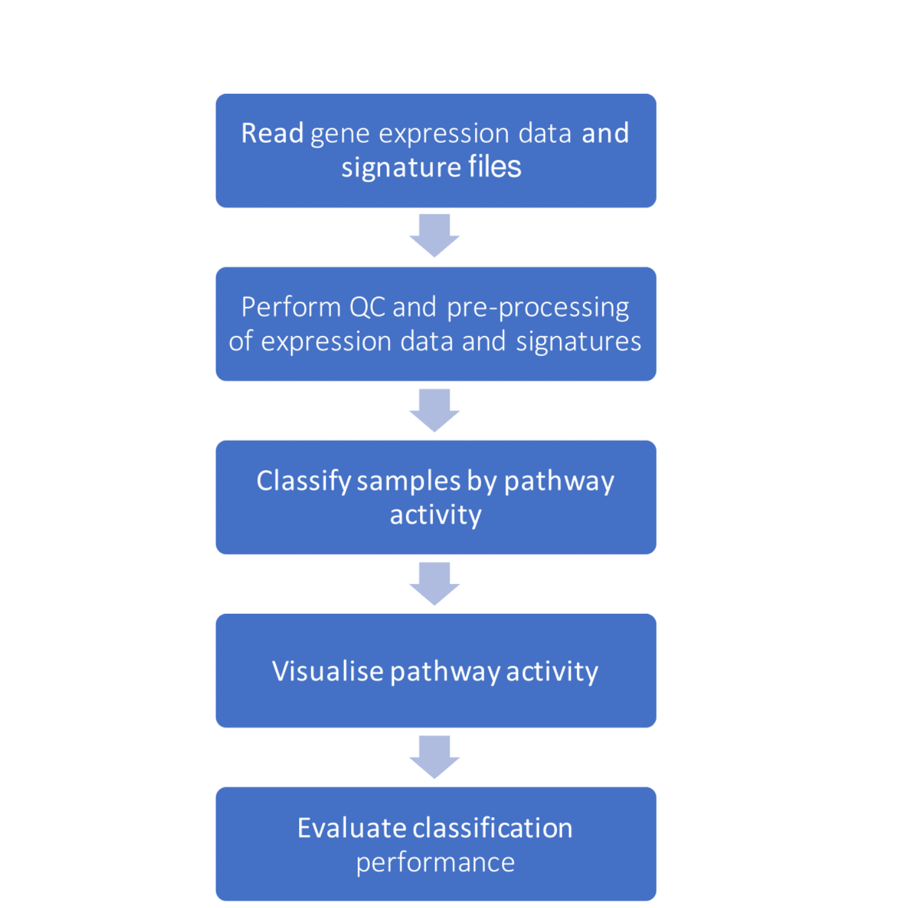
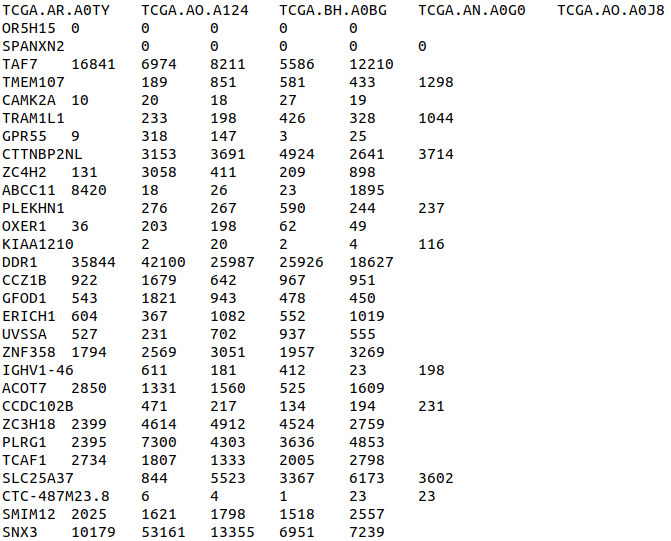

# PathAnalyser

# Summary

  PathAnalyser is a flexible and user-friendly R package that provides functionality for assessing ER and 
  HER2 pathway activity in breast cancer transcriptomic datasets by using a gene expression signature. Unlike 
  other available pathway assessment packages, which do not distinguish between up-regulated and down-regulated gene sets, 
  PathAnalyser classifies samples as "active" or "inactive" for a pathway, only if there is a consensus in the
  evidence of expression consistency with both the up-regulated and down-regulated gene sets of the gene signature.
 

# Table of Contents

- [Summary](#summary)
- [PathAnalyser workflow](#pathanalyser-workflow)
- [Installation](#installation)
    - [Dependencies](#dependencies)
    - [Install PathAnalyser from source](#install-pathanalyser-from-source)
- [Input File Formats](#input-file-formats)
- [Quick Start](#quick-start)
    - [Load PathAnalyser](#load-pathanalyser)
    - [Reading data from input files](#reading-data-from-input-files)
      - [Gene expression data set file](#gene-expression-data-set-file) 
      - [Gene signature files](#gene-signature-files)   
    - [QC and pre-processing of gene expression dataset](#qc-and-pre-processing-of-gene-expression-dataset)
    - [Classification based on pathway activity](#classification-based-on-pathway-activity)
    - [Visualising classification](#visualising-classification-using-pca)
    - [Classification evaluation with true labels (optional)](#classification-evaluation-with-true-labels-optional)
- [If you wish to know more](#if-you-wish-to-know-more)
  
# PathAnalyser workflow
The typical workflow for using the package is outlined below:



**Note**: Assessment of classification is optional and can only occur if true pathway class labels ("Active", "Inactive", "Uncertain")
are available for the transcriptomic dataset.

# Installation

## Dependencies

PathAnalyser needs the following:
- **R** (tested on version 4.1.1)
- **GSVA** Bioconductor package (1.42.0) required by classification algorithm
- **The following R libraries:** (The number is the version tested during development)

```` 
   GSVA (1.40.1)           lifecycle (1.0.1)
   VennDiagram (1.7.1)     futile.logger (1.4.3) 
   reader (1.0.6)          NCmisc (1.1.6)        
   ggplot2 (3.3.5)         reshape2 (1.4.4)
   edgeR (3.34.1)          limma (3.48.3)        
   plotly (4.10.0)
````
**Note:** The package is platform-independent; it was developed and runs on multiple operating systems (Windows, MacOS, Linux).

All dependencies should be installed together with the PathAnalyser package,
however, they can be installed separately. To install all required CRAN 
dependencies of PathAnalyser, type the following in R:
```{r eval=F}
install.packages(c("ggfortify", "ggplot2", "glue", "lifecycle", "cli", "plotly",
                   "reader", "reshape2", "rlang", "withr"
                   ))

```
All Bioconductor dependencies can be installed by typing the following in R:
```{r eval=F}
# if not previously installed
install.packages("BiocManager") 
BiocManager::install(c("GSVA","edgeR", "limma"))
```

## Install PathAnalyser from source

You can download the latest source tarball file (ending in .tar.gz) from the latest release section by clicking on this [link](https://github.com/ozlemkaradeniz/PathAnalyser/releases).

Then to install this local source package type the following in R:

```{r eval=F}
library(utils)
install.packages("PathAnalyser_0.0.0.9000.tar.gz", repos = NULL, type = "source")
```

For instructions for more advanced installations, please consult the vignette (/docs).

# Input file formats
PathAnalyser can read two types of input data files:

1. A **gene expression data set file** containing a table with sample names or IDs as column names, and gene names as row names<br/>
   An example gene expression data set file:
    
    
    
2. **Gene signature files** (for up-regulated gene-set and another for down-regulated gene-set) in the gene-set file format (ending with .grp)(for further detail click this [link](https://software.broadinstitute.org/cancer/software/gsea/wiki/index.php/Data_formats#GRP:_Gene_set_file_format_.28.2A.grp.29)). Currently, PathAnalyser requires
   2 gene signatures files for each gene set (up-regulated and down-regulated gene set) for a gene signature of a given pathway.<br/> 
   An example gene signature file for the up-regulated gene-set of a gene signature:
   
   

# Quick Start
## Load PathAnalyser
Once the package is installed, to start using PathAnalyser simply load the PathAnalyser package in R:
```{r eval=F}
library(PathAnalyser)
```
## Reading data from input files
### Gene expression data set file
To read a gene expression data set file (tab or comma value separated files i.e. files with extension .tsv/.csv/.txt), type the following in R:
```{r eval=F}
data_set <- read_expression_data("gene_expr.txt")
```
### Gene signature files
To read the two signature files comprising the up-regulated gene set and down-regulated gene set of the gene signature, type the following in R using `up_sig_file` and `down_sig_file` parameters:
```{r eval=F}
sig_df <- read_signature_data(up_sig_file="up_gene_sig.grp", down_sig_file="down_gene_sig.grp") 
```
## QC and pre-processing of gene expression dataset
The classification functions of PathAnalyser require the expression dataset to be normalised.<br/>

**For unnormalised RNA-seq data only**, perform logCPM transformation on an unnormalised (raw count-containing) gene expression matrix (`data_set`) generated by `read_expression_data` by typing the following in R:
```{r eval=F}
norm_data <- log_cpm_transformation(data_set)
```
**Note:** Microarray datasets must be normalised prior to performing classification using PathAnalyser, as the package currently does not contain functionality for normalising microarray datasets.<br/>

For further quality control and data pre-processing including filtering genes from the gene expression matrix that are not present in the gene signature data frame, or those genes lacking expression values in < 10% of the total number of samples can be performed by calling the `check_signature_vs_dataset` with the logCPM transformed gene expression matrix (`norm_data`) and gene signature data frame (`sig_df`) generated from using `read_signature_file` as arguments: 
```{r eval=F}
norm_data <- check_signature_vs_dataset(norm_data=norm_data, sig_df=sig_df)
```

## Classification based on pathway activity
Pathway-based classification can be performed by using the classify_GSVA_percent function with a normalised gene expression matrix and gene signature data frame:
```{r eval=F}
# Using default percentile threshold (quartile = 25%)
norm_data <- classify_GSVA_percent(norm_data, sig_df)
```
A custom percentile threshold can be provided by the user for tuning the pathway-based classification, by adding the `percent_thresh` parameter:
```{r eval=F}
# Using a 50th percentile threshold (50%)
classes_df <- classify_GSVA_percent(norm_data, sig_df, percent_thresh=50)
```
The generated output (`classes_df`) of the classification function is a data frame containing samples names as the first column and the predicted activity class for a given pathway as the second column ("Active", "Inactive", "Uncertain").

## Visualising classification using PCA
An interactive PCA plot for visualising the pathway-based classification of samples can be achieved by using the `classes_PCA` function with the normalised expression matrix (`norm_data`), the data frame produced by the `classify_GSVA_percent` function (`classes_df`) and the pathway of interest:
```{r eval=F}
classes_PCA(norm_data, classes_df, pathway = "ER")
```
## Classification evaluation with true labels (optional)
**If true pathway class labels are available for the classified dataset**, users can obtain evaluation metrics for the classification such as accuracy, sensitivity, recall etc using the `calculate_accuracy` function with a predicted classes data frame (`classes_df`) containing sample names as the first column and true pathway class labels ("Active", "Inactive", "Uncertain") as the second column, a data frame containing the same sample names in the first column and true pathway class labels as the second column and the pathway name:

```{r eval=F}
confusion_matrix <- calculate_accuracy("Sample_labels.txt", classes_df, 
                                       pathway = "ER")
```
For further examples of using PathAnalyser in pathway-based classification analysis, please refer to the demo script (under /demo folder) and use the provided supplementary data. You can obtain 

# If you wish to know more

If the PathAnalyser GitHub repository is public, look in the vignette here:
http://ozlemkaradeniz.github.io/PathAnalyser/

