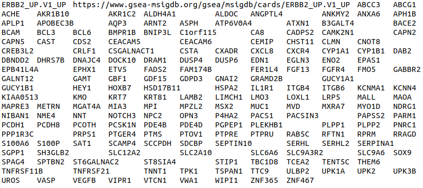
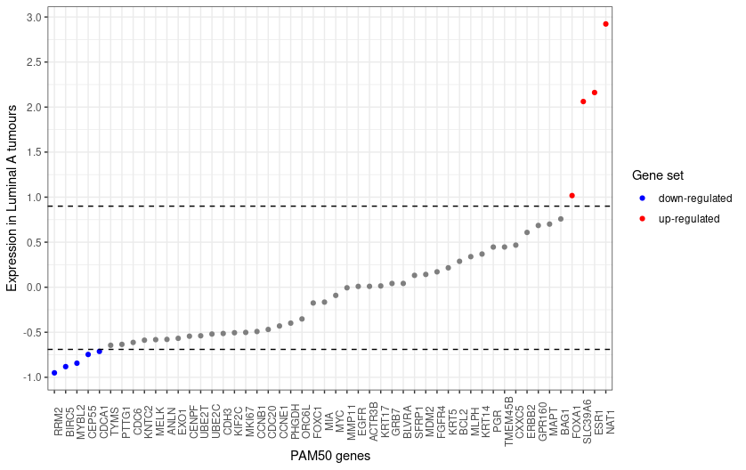
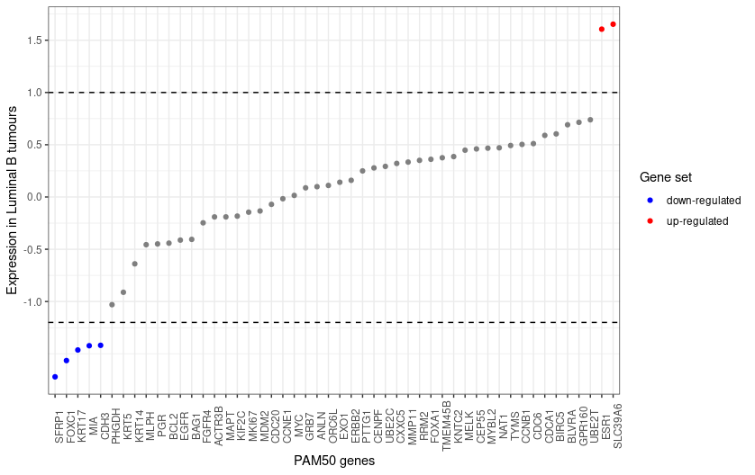
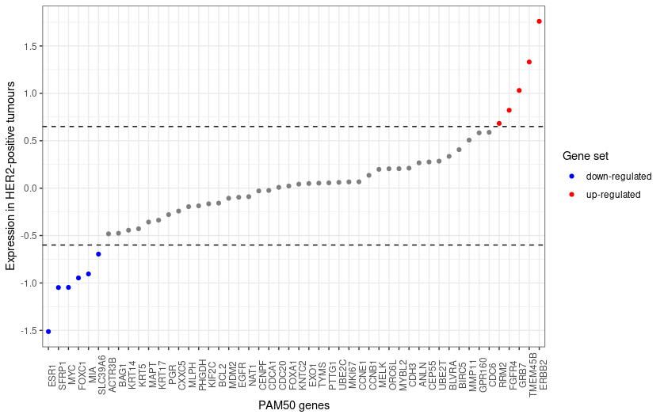

```{r setup, include = FALSE}
knitr::opts_chunk$set(
  collapse = TRUE,
  comment = "#>",
  message = FALSE,
  warning = FALSE
)
```

# Introduction
PathAnalyser is user-friendly package that allows users to assess pathway 
activity of transcriptomic data sets using the gene signature of a given 
pathway. Typically gene signatures can be broadly classified into the following 
three categories:

1. **gene-sets** - list of genes without information regarding the strength or 
direction of association with a phenotype
2. **weighted gene lists** - lists of genes with numerical weights representing 
strength and direction of association with a phenotype
3. **gene-signature containing** only direction of association with the phenotype* 
(i.e. a list of up-regulated and down-regulated genes).

Several currently available packages and algorithms classify samples using 
gene-sets such as GSVA and GSEA methods ([Suberman et al., 2005, Hänzelmann et al., 2013][References]) or weighted gene lists such as the PAM50 algorithm [Parker et al., 2009][References]. However, 
*despite the third type of signature (direction-associated gene signatures) being 
reported by numerous publications, there is currently no software tools 
available for classifying samples based on these signatures*. PathAnalyser 
addresses this need by providing functionality for classifying samples by 
pathway activity using these highly reported and widely available gene 
signatures.

## A focus on ER & HER2 pathway activity in breast cancer

PathAnalyser provides a range of functionality and built-in data, including gene 
expression datasets (RNA-seq and microarray) as well as gene signatures for 
assessing ER and HER2 pathway activity in breast cancer transcriptomic data sets. 
These transcriptional signatures have been shown to have prognostic significance, 
in particular, ER and HER2 gene signatures have been associated with molecular 
sub-types, prognosis, treatment response and risk of recurrence in breast 
cancer ([Parker et al., 2009; Symanns et al., 2011][References]). The clinical 
utility of such signatures has already been demonstrated, for example, by the 
adoption of ER signatures in molecular testing and standard management of early 
stage estrogen-positive breast cancer, 
([Litton, Burstein, and Turner, 2019][References]). Although this package was 
original developed to assess ER and HER2 pathway activity in breast cancer 
transcriptomic data sets, the package functionality is flexible and could be 
applied to transcriptomic data sets and gene signatures outside the context of 
breast cancer. 

In this vignette, we will describe how to use the PathAnalyser package 
with microarray and RNA-seq expression transcriptomic data sets and gene 
expression signatures associated with activity of ER and HER2 pathway.

# General Workflow
The typical workflow of pathway activity assessment using PathAnalyser is 
summarised in Figure \@ref(fig:workflow).

```{r workflow, echo=F, fig.wide=TRUE, fig.cap="PathAnalyser workflow"}
knitr::include_graphics("workflow_flowchart.png")
```

**Note**: The **classification evaluation step is optional** and can only be 
performed if actual pathway activity class labels (e.g. positive, negative or 
uncertain) for the corresponding pathway are present.

# Installation and setup
## Installing dependencies
All dependencies should be installed together with the PathAnalyser package,
however, they can be installed separately. To install all required CRAN 
dependencies of PathAnalyser, type the following in R:
```{r eval=F}
install.packages(c("ggfortify", "ggplot2", "plotly", "reader", "reshape2"))

```
All Bioconductor dependencies can be installed by typing the following in R:
```{r eval=F}
# if not already installed, install BiocManager
install.packages("BiocManager")
BiocManager::install(c("GSVA","edgeR", "limma"))
```

## Installing the package 
It is **strongly recommended** that users install the latest source release 
of PathAnalyser by downloading the tarball source file on GitHub from the [latest
source release](https://github.com/ozlemkaradeniz/PathAnalyser/releases/tag/v0.0.0.9000) 
section of the PathAnalyser GitHub repository and then installing this local 
source version of the package in R:
```{r eval=F}
install.packages("PathAnalyser_1.0.0.tar.gz", repos=NULL, type="source",
                 dependencies=TRUE)
```

### Using devtools for direct installation from GitHub
PathAnalyser can also be installed directly from GitHub using the devtools 
package in R, provided the PathAnalyser GitHub repository is public:
```{r eval=F}
install.packages("devtools")
devtools::install_github("ozlemkaradeniz/PathAnalyser")
```
**Note**: If the PathAnalyser repository is not public, the `install_github` 
function will not download and install the package.

### Cloning the repository (for developers)
Alternatively, for users who would like to extend the PathAnalyser package, they 
can clone the GitHub repository in a Linux / MacOS terminal:
```{bash eval=F}
git clone git@github.com:ozlemkaradeniz/PathAnalyser.git
```
and build the package from the source files using devtools:
```{r eval=F}
devtools::build("~/PathAnalyser")
```
**Note**: Building the package from source files requires r-base-dev 
(Linux/MacOS) or Rtools (Windows) installation on top of the base R installation
.

Once installation is completed, load the library to start using PathAnalyser:
```{r message=FALSE, warning=FALSE, cache=FALSE}
library(PathAnalyser)
```

# Data formats
The classification algorithm of PathAnalyser requires two types of input data:

1. **Gene expression matrix** - a gene-by-sample gene expression matrix, with 
row names corresponding to gene symbols and column names corresponding to sample 
names / IDs.

**Note**: Row names of the gene expression matrix are **expected to be gene symbols** as
most available transcriptional pathway signatures are given as a
list of gene symbols. PathAnalyser currently **does not provide functionality for 
gene ID or probe ID conversion to gene symbols.**

2. **gene signature data frame** - a data frame of expression values corresponding 
to a list of up-regulated and down-regulated genes associated with a pathway. 
The first column contains gene symbols and the second column contains expression 
values: -1 for down-regulated or 1 for up-regulated genes when a specific 
pathway is active.

## Input files
The two data types described above (gene expression matrix and gene signature 
dataframe) can be created from three types of input files:

1. **Gene expression matrix file** - a tab-delimited text file containing a gene 
expression matrix, where rows represent genes and columns represent samples of a 
gene expression data set. The gene expression matrix text file can contain 
expression values from RNA-seq or normalized microarray data. The image below is 
a snapshot of an example expression data set file:

```{r echo=FALSE, fig.cap="An example gene expression matrix text file"}
knitr::include_graphics("expr_dataset_example.png")
```

The first line contains the sample names and the first column contains gene 
names. All other tab-separated fields represent expression values for each gene
for each sample from either RNA-seq or microarray experiments. 

**Note**: PathAnalyser **does not provide functionality for unnormalised microarray 
data**, so the user must ensure the microarray data is normalised, prior to 
performing classification using PathAnalyser.  

2. **Gene signature files** - this data is provided as two text files, one 
containing a list of genes constituting the up-regulated gene-set and another 
list of genes for the down-regulated gene set of the 
gene signature. These signature files can be provided in one of the two popular 
gene set database file formats: 

    1. [gene set file format](https://software.broadinstitute.org/cancer/software/gsea/wiki/index.php/Data_formats#GRP:_Gene_set_file_format_.28.2A.grp.29) (GRP) - a basic new-line-delimited text file, 
    where each gene is present on its own line and "#" lines denote comments (fig. \@ref(fig:grp)).

```{r grp, echo=FALSE, fig.cap="A snapshot of a GRP gene set file containing the up-regulated gene set of an ERBB2 gene signature. Only the first 30 lines of the file are shown."}
knitr::include_graphics("grp_file.png")
```
    
    
  2. [gene matrix transposed fileformat](https://software.broadinstitute.org/cancer/software/gsea/wiki/index.php/Data_formats#GMT:_Gene_Matrix_Transposed_file_format_.28.2A.gmt.29) (GMT) - a tab-separated file format where each row represent a single gene set (fig. \@ref(fig:grp)).
    
```{r gmt, echo=FALSE, fig.cap="An example GMT gene set file containing the up-regulated gene set of an ERBB2 gene signature"}

```

A multitude of gene signatures for various signalling pathways are available for
download from [MSigDB](https://www.gsea-msigdb.org/gsea/msigdb/index.jsp) in 
both of the accepted gene set file formats stated above.

**Note**: `read_signature` from PathAnalyser only accepts gene signatures 
that have the up-regulated and down-regulated gene sets in separate gene set 
format text files (either in GRP or GMT formats). The user is expected to 
provide one up-regulated and one down-regulated gene set file for a pathway gene 
signature.

# Built-in datasets and gene signatures
## Gene expression signatures
PathAnalyser contains two gene signatures specific for active ER and HER2 
pathways, in addition to ER and HER2 gene signatures derived from the PAM50 gene 
signature (see section \@ref(pam50-signatures)) that can be used to assess ER 
and HER2 pathway activity in a breast cancer transcriptomic data set. These 
signatures are accessible by typing the following in `ER_SET_sig` for the ER 
signature and `HER2_Smid_sig` for the HER2 signature in R. Alternatively, these 
signatures can be loaded into the R environment "lazily" by using the `data` 
function as follows:

```{r}
data("ER_SET_sig")
data("HER2_Smid_sig")
```
Note that lazily loading these signature data results in the creation of 
"promise", which means that the data only occupies memory once the data is used. 

### ER signature
The built-in ER signature `ER_SET_sig` is a data frame containing the names of 
the 160 most differentially expressed genes which constitute the transcriptional 
signature of ER pathway activation. This signature was obtained from the 
sensitivity to endocrine therapy genome index defined by 
[Symanns et al. (2011)][References]. 
The total number of genes that are up-regulated (denoted with an expression 
value of 1) and down-regulated (denoted with an expression value of -1) in this 
gene signature are 101 and 59 genes respectively.
```{r}
dim(ER_SET_sig)
head(ER_SET_sig)
# up-regulated genes are given an expression value of 1
ER_up_sig <- ER_SET_sig[ER_SET_sig$expression == 1 ,]
dim(ER_up_sig)
# down-regulated genes are given an expression value of -1
ER_dn_sig <- ER_SET_sig[ER_SET_sig$expression == -1 ,]
dim(ER_dn_sig)
# for more details
?ER_SET_sig
```

### HER2 signature
A gene expression signature for HER2 (ERBB2) pathway activation `HER2_Smid_sig` is 
also provided by PathAnalyser. This gene signature was obtained from Molecular 
Signatures Database ([MSigDB](https://www.gsea-msigdb.org/gsea/msigdb/index.jsp)) 
by combining the up-regulated (gene set:[SMID_BREAST_CANCER_ERBB2_UP](https://www.gsea-msigdb.org/gsea/msigdb/cards/SMID_BREAST_CANCER_ERBB2_UP.html)) 
and down-regulated (gene set:
[SMID_BREAST_CANCER_ERBB2_DN](https://www.gsea-msigdb.org/gsea/msigdb/cards/SMID_BREAST_CANCER_ERBB2_DN.html)) 
gene sets available at MSigDB, originating from transcriptomic profiling of a 
344 primary breast tumor samples in a study by [Smid et al. 2010][References] in 
a study which examined the subtypes of breast cancer and organ-specific relapse. 

The gene symbols of 156 genes constituting the gene signature are in the HER2 
signature data frame provided by PathAnalyser, of which 190 are up-regulated 
(denoted by an expression of 1) and 197 are down-regulated (denoted by an 
expression of -1).
```{r}
dim(HER2_Smid_sig)
head(HER2_Smid_sig)
# up-regulated genes are given an expression value of 1
HER2_up_sig <- HER2_Smid_sig[HER2_Smid_sig$expression == 1 ,]
dim(HER2_up_sig)
# Down-regulated genes are given an expression value of -1
HER2_dn_sig <- HER2_Smid_sig[HER2_Smid_sig$expression == -1 ,]
dim(HER2_dn_sig)
# for more details
?HER2_Smid_sig
```

### PAM50 signatures
PathAnalyser also provides ER and HER2 signatures extracted from the PAM50 gene 
signature, a list of 50 genes that have been associated with five intrinsic 
molecular sub-types of breast cancer: Luminal A, Luminal B, HER2-enriched, 
basal-like and normal-like ([Parker et al., 2009][References]). These PAM50 ER 
and HER2 signatures built-in PathAnalyser are stored in a list object called 
`pam50` which can be accessed by typing the following in R:
```{r}
# get PAM50 list object from PathAnalyser
data("pam50")
# pam50 object has two elements: one containing a data frame for the ER signature
# and another for the HER2 signature
str(pam50)
# to access PAM50 ER signature
pam50$ER
# to access Pam50 HER2 signature
pam50$HER2
```

The PAM50 gene data built into PathAnalyser was extracted from the `pam50` list 
object, a built-in data object provided by the [genefu](https://bioconductor.org/packages/release/bioc/html/genefu.html) 
package, which also provides a suite of functionality for gene expression 
analysis in breast cancer ([Gendoo et al., 2016][References]).

#### ER signature
As luminal A and B are established ER-positive breast cancer subtypes 
([Zhang et al., 2014][References]), a list of the most informative genes for the 
PAM50-derived ER-signature were curated from these two specific sub-types. First 
the PAM50 genes, were ordered by the luminal A centroid index in ascending order 
and the relative expression level represented by the centroid index were plotted 
to assist manual selection of the most informative genes (Fig. \@ref(fig:lumAPam50))
Genes that had most deviant expression levels relative the rest of the genes were 
selected as the most informative genes using custom thresholds for the most 
up-regulated and down-regulated genes from manual inspection of the expression 
levels of the PAM50 genes. As evident in Figure \@ref(fig:lumAPam50), the five 
genes: RMMD, BIRC5, MYBL2, CEP55, CDCA1 which had expression levels below the 
custom threshold of -0.69 (bottom dashed line) are relatively the most 
down-regulated compared to the other genes and thus were selected as the 
down-regulated gene-set (coloured blue). Similarly, four genes (FOXA1, SLC39A6, ESR1, NAT1) 
which had expression exceeding the custom threshold of 0.9 (top dashed line), 
exhibited the greatest up-regulation (coloured red) relative to the other genes 
and therefore were selected as the up-regulated gene-set of the PAM50 ER signature.

```{r lumAPam50, echo=FALSE, fig.wide=TRUE, fig.cap="PAM50 genes ordered by their corresponding Luminal A centroid index. Red genes represent up-regulated genes, while blue genes represent down-regulated genes extracted from the luminal A subtype for inclusion in the PAM50-derived ER gene signature. Dashed lines represent custom thresholds used to categorise genes as the most up-regulated (top) and down-regulated (bottom)."}

```
Likewise, for the Luminal B sub-type, the PAM50 genes were ordered by their 
corresponding Luminal B centroid index and the most deviant genes were selected 
as the most informative genes for the sub-type (fig. \@ref(fig:lumBPam50)), using 
custom thresholds for most differentially expressed genes from manual inspection. An 
additional five genes (SFRP1, FOXC1, KRT17, MIA, CDH3) which demonstrated the 
most disparate down-regulation (coloured blue) relative to the rest of the genes,
as delimited by the custom threshold of -1.2, were selected for the 
down-regulated gene-set for the PAM50 gene signature. Two genes 
(ESR1 and SLC39A6) which displayed the greatest up-regulation relative to the 
other genes, as delineated by the custom up-regulated gene threshold of 1 for 
the Luminal B sub-type were pre-selected for the up-regulated gene-set from the 
Luminal A gene-set curation (coloured red).
```{r lumBPam50, echo=FALSE, fig.wide=TRUE, fig.cap="PAM50 genes ordered by their corresponding Luminal B centroid index. Red genes represent up-regulated genes, while blue genes represent down-regulated genes extracted from the luminal B subtype for the PAM50-derived PAM50 gene signature. Dashed lines represent custom thresholds used to categorise genes as the most up-regulated (top) and down-regulated (bottom)."}

```

Therefore, the complete ER signature from PAM50 contains 14 genes in total:

- **4 up-regulated genes:** FOXA1, SLC39A6, ESR1, NAT1  
- **10 down-regulated genes:** RRM2, BIRC5, MYBL2, CEP55, CDCA1, SFRP1, FOXC1, KRT17, MIA, CDH3


As described above, the ER signature extracted from PAM50 can be retrieved from 
the ER slot of the `pam50` object as follow:
```{r}
# load pam50 object into R
data("pam50")
# Access ER signature from pam50
pam50$ER
```


#### HER2 signature
Similarly, the list of genes extracted for the HER2 signature from PAM50 was 
acquired using data from the HER2-enriched sub-type from PAM50. The PAM50 genes
were ordered by HER2-enriched centroid index in ascending order and a plot was 
created to assist the manual curation of the HER2 signature, using custom 
thresholds for down-regulated and up-regulated genes from manual inspection of 
the relative expression levels for each gene, as shown in Figure 
\@ref(fig:her2Pam50). The most informative genes were selected which 
demonstrated the most deviant expression levels (coloured red and blue) were 
selected. The six genes (ESR1, SFRP1, MYC, FOXC1, MIA, SLC39A6) exhibiting the 
most deviant down-regulation relative to the other genes, as delimited by the custom threshold 
of -0.65, were selected as the down-regulated gene-set (coloured blue) for the 
HER2 signature derived from PAM50. Likewise, the six genes 
(RRM2, FGFR4, GRB7, TMEM45B, ERBB2) which displayed the greatest up-regulation 
relative to the other PAM50 genes (with expression exceeding the custom 
threshold of 0.65) were selected as the up-regulated gene-set (coloured red) for 
the PAM50 HER2 gene signature.
```{r her2Pam50, echo=FALSE, fig.wide=TRUE, fig.cap="PAM50 genes ordered by their corresponding HER2 centroid index. Red genes represent up-regulated genes, while blue genes represent down-regulated genes selected for the PAM50-derived HER2 gene signature. Dashed lines represent custom thresholds used to categorise genes as the most up-regulated (top) and down-regulated (bottom)."}

```

## Gene expression data sets
### RNA-seq datasets
PathAnalyser also contains two built-in RNA-seq gene expression matrices:

1. `ER_TCGA_RNAseq` (30 ER+/- breast cancer samples)
2. `HER2_TCGA_RNAseq` (30 ER+/- breast cancer samples)

each containing RNA-seq raw read counts for primary breast cancer samples 
obtained from 60 individuals (cases) extracted from a much larger data set of 
1,101 samples. Data for these matrices were obtained from The Cancer Genome Atlas ([TCGA](https://www.cancer.gov/about-nci/organization/ccg/research/structural-genomics/tcga)).
Each expression matrix contains 20,124 genes.
```{r}
data("ER_TCGA_RNAseq")
data("HER2_TCGA_RNAseq")
# column names represent case (sample) IDs from TCGA
```


#### ER data set
The ER data set `ER_TCGA_RNAseq` contains RNA-seq raw read counts for 60 primary 
breast cancer samples, 30 of which were randomly selected for postive ER pathway 
activity (ER+) and another 30 were selected at random which exhibited ER pathway 
inactivation (ER-).
```{r}
dim(ER_TCGA_RNAseq)
# Expression data for first 6 genes
head(ER_TCGA_RNAseq[,1:5])
```

#### HER2 data set: `HER2_TCGA_RNAseq`
Similarly, the HER2 data set `HER2_TCGA_RNAseq` contains RNA-seq raw read counts for 
60 primary breast cancer samples, 30 of which have HER2 (ERBB2) pathway activity 
(HER2+) and 30 which have inactive HER2 pathway activity (HER2-).

```{r}
dim(HER2_TCGA_RNAseq)
# Expression data for first 6 genes of the first 5 samples
head(HER2_TCGA_RNAseq[,1:5])
```

### Microarray data sets
In addition to RNA-seq data sets, PathAnalyser also stores two built-in 
microarray data sets that are subsets from a larger microarray dataset 
([GSE31448](https://www.ncbi.nlm.nih.gov/geo/query/acc.cgi?acc=GSE31448)) from a
study by [Sabatier et al., (2011)][References]:

1. `ER_GEO_microarr` (30 ER+/- breast cancer samples)
2. `HER2_GEO_microarr` (30 HER2+/- breast cancer samples)

The original data set contained microarray data for 357 human breast cancer 
tumour samples and was acquired from the Gene Expression Omnibus 
([Edgar, R., Domrachev, M. and Lash, A.E. et al., 2002][References])
repository. Multi-gene probes were discarded from the data set leaving expression 
data for 21,656 genes.

#### ER data set: `ER_GEO_microarr`
`ER_GEO_microarr` contains sixty samples selected from the 357 human breast 
cancer sample microarray data set, of which 30 samples were randomly selected 
from an ER positive subset and 30 were randomly selected ER negative sample 
subset of the original data set. 
```{r}
# access ER_GEO_microarr data
data(ER_GEO_microarr)
# expression data for 21,656 genes for 60 samples
dim(ER_GEO_microarr)
# data for first 6 genes of the first 5 samples
head(ER_GEO_microarr[,1:5])
```

#### HER2 data set: `HER2_GEO_microar`
`HER2_GEO_microarr` contains microarray array data for sixty human breast cancer 
samples from the GSE31448 microarray dataset, which are either HER2-positive or 
HER2-negative. Thirty of the sixty samples were randomly selected from the HER2 
positive subset of the dataset and the remaining thirty samples were randomly 
selected from the HER2 inactive subset of the original dataset.  
```{r}
# access HER2_GEO_microarr data
data(HER2_GEO_microarr)
# expression data for 21,656 genes for 60 samples
dim(HER2_GEO_microarr)
# data for first 6 genes of the first 5 samples
head(HER2_GEO_microarr[,1:5])
```


# Reading input data using PathAnalyser
As described above, there are two types of input required for pathway activity 
assessment using PathAnalyser:

1.  gene expression data matrices
2.  gene expression signatures

## Gene expression data
The `read_expression_data` function reads gene expression data from a file with 
either tab, comma or white-space delimiter, the function checks the delimiter of
the file and reads the file accordingly. It returns a numerical matrix with gene
symbols as the row names and sample IDs / names as column names. Each column 
represent gene expression data for a single sample, while each row represents 
expression data for a given gene across the samples of the data set. As 
mentioned above, row names are expected to be gene symbol as most 
pathway-associated signatures provide gene names as gene symbols. If a user, 
would like to assess pathway activity of microarray data sets, the user must 
ensure the gene names are given as *gene symbols* as PathAnalyser currently does
not provide functionality for gene or probe ID conversion to gene symbols.

```{r}
data_mat <- read_expression_data("../inst/extdata/HER2_toydata_RNAseq.txt")
# Gene expression data of the first 5 genes for the first 5 samples
data_mat[1:5, 1:5]
```
### Missing values
Genes that contain `NA`s or missing values for any of the samples in the data 
set are removed from the gene expression matrix, since the GSVA algorithm which 
is used by PathAnalyser to estimate expression abundance of the two gene-set of 
the gene signature, discards such genes from its analysis.

### Sample and gene duplication
Duplicated samples are removed, leaving only the first sample entry of the 
duplicated samples. Duplicated genes are merged into a single gene row in the 
expression matrix by averaging the duplicated-gene expression values for each 
sample.

## Gene signature data
Gene signature files can be read by the `read_signature` function. It returns a 
data frame with gene symbols in the first column and their relative expression 
change in the gene signature represented as 1 for up-regulated genes and -1 for 
down-regulated genes. As previously mentioned, the gene signature input files 
can be in GRP or GMT file formats, but the up-regulated and down-regulated 
gene-set must be provided in separate input files.
```{r}
sig_df <- read_signature("../inst/extdata/SMID_BREAST_CANCER_ERBB2_UP.grp", 
                         "../inst/extdata/SMID_BREAST_CANCER_ERBB2_DN.grp")
# first 6 genes of the gene signature
head(sig_df)
```

# Quality control and pre-processing of data
### Log counts per million (CPM) transformation of RNA-seq expression matrices
The `log_cpm_transform` function transforms the raw RNA-seq counts by performing 
a log CPM transformation on the data, which is required since PathAnalyser 
requires expression data to be normalised prior to classification. It also 
performs a visual sanity check of the transformation by returning box plots for 
visualization of distribution of gene counts before and after transformation.
```{r fig.wide=TRUE}
norm_data <- log_cpm_transform(data_mat)
```

### Checking and filtering genes from the gene expression matrix
The gene names are first checked for inclusion in the gene signature data frame.
Genes that are included in the gene signature are retained then subjected to 
further filtration, in which their expression across the samples in data set is 
measured. If a gene is not present in at least 10% of the total number of 
samples in the data set, the gene is dropped from the expression matrix. A 
console message is printed reporting the total number of features (genes) 
retained in the final normalized expression matrix. A bar plot depicting the 
mean-normalised counts for each gene in the normalised gene expression matrix is
also displayed. 
```{r fig.wide=TRUE}
norm_data <- check_signature_vs_dataset(norm_data, ER_SET_sig)
```

**Note:** Genes with multiple names (often delimited with "///") will be 
filtered out of the gene expression matrix.

# Classifying samples by pathway activity using gene signatures
## Overview of pathway activity classification
PathAnalyser provides assessment of pathway activity for each sample in a gene 
expression data set, by using a directional-associated gene signature and 
extending an existing robust unsupervised and non-parametric sample-wise gene set enrichment method called 
Gene set variation analysis ([GSVA](https://www.bioconductor.org/packages/release/bioc/html/GSVA.html)). 
GSVA measures the variation of gene set enrichment across a sample population in 
a manner independent of class labels, and summarizes the sample-wise expression 
of the gene set in the form of gene set enrichment scores for each sample 
([Hänzelmann et al. 2013][References]). However, unlike GSVA, which fails to 
consider the direction of association of gene-sets and thus would consider the 
entire gene signature as only an associated gene-set, PathAnalyser factors the 
directionality of association of the up-regulated gene-set and down-regulated 
gene-set, using GSVA under the hood to reduce the dimensionality of the gene 
expression dataset to two directional gene-sets of the gene signature and 
then correlates the expression abundace estimation provided by GSVA with 
pathway activity states "Active", "Inactive", or "Uncertain".

## PathAnalyser classification algorithm
The estimated expression abundance described above for both the up-regulated and 
down-regulated gene sets is used as a metric to check expression consistency 
with the gene signature and infer pathway activity for a given sample in the 
transcriptomic data set.

The classification algorithm implemented in PathAnalyser uses under the hood 
four thresholds (percentiles or absolute GSVA scores) for pathway-based 
classification (two for each gene set of the pathway signature):

1. **High** expression abundance for **up-regulated gene set** (minimum 
threshold for evidence of pathway activation from up-regulated gene-set).
2. **Low** expression abundance for **up-regulated gene set** (maximum threshold
for evidence of pathway inactivation from up-regulated gene-set)
3. **High** expression abundance for **down-regulated gene set** (minimum 
threshold for evidence of pathway inactivation from the down-regulated gene-set)
4. **Low** expression abundance for **down-regulated gene set** (minimum 
threshold for evidence of pathway activation from the down-regulated gene-set)

Figure \@ref(fig:algorithm) below summarises the classification algorithm 
employed by PathAnalyser to classify samples by pathway activity.

```{r algorithm, echo=FALSE, fig.wide=TRUE, fig.cap="Overiew of algorithm diagram"}
knitr::include_graphics("algorithm_diagram.png")
```

## Classification using percentile GSVA score thresholds
PathAnalyser enables users to select percentile thresholds `classify_gsva_abs` 
or absolute GSVA score thresholds `classify_gsva_abs` (see [Appendix][Appendix] 
for further details) to tune the classification algorithm according to user's 
classification requirements. The default classification method is using 
percentile thresholds with the `classify_gsva_percent` which ranks samples by 
expression abundance first for the up-regulated gene-set then again, for the 
down-regulated gene-set of the gene signature. The default percentile threshold 
used by the algorithm is 25% (a quartile threshold) but can be customised using 
the `percent_thresh` parameter. 

Using the default quartile threshold as an example, samples which are ranked in 
the top 25% of samples for expression abundance of the up-regulated gene-set and 
also in the bottom 25% for expression abundance for the down-regulated gene-set 
show consensus between the evidence of expression consistency with both gene-set 
of the gene signature and are thus classified as "*Active*" for the pathway. On 
the contrary, samples ranked in the bottom quartile (25%) for expression 
abundance of the up-regulated gene-set and also in the top quartile for 
expression abundance in the down-regulated gene-set, reveal a consensus in the 
evidence of expression inconsistency with both gene-sets of the gene-signature 
and these samples are therefore classified as "*Inactive*" for the given 
pathway. Remaining samples including those that reveal evidence of consistent 
expression with only the up-regulated or down-regulated gene-set are classified 
as "*Uncertain*".

A summary breakdown of the classification is printed to the console 
highlighting the number of samples in each pathway activity class 
("Active", "Inactive" and "Uncertain") and the number of samples in total. 

```{r}
# default percentile = 25% (quartile)
classes_df <- classify_gsva_percent(norm_data, ER_SET_sig)
```
Increasing the percentile threshold for classification has the equivalent 
effect of reducing the expression abundance uncertainty region between the 
high expression abundance and low expression abundance thresholds for both gene 
sets, therefore reducing the frequency of "Uncertain" classifications. Indeed, 
50% percentile threshold would allow only "Uncertain" classification of samples 
that are consistent only with either the up-regulated or down-regulated gene-sets.

```{r}
# custom percentile = 50%
classes_df <- classify_gsva_percent(norm_data, ER_SET_sig, percent_thresh=50)
```


# Visualising pathway activity
An interactive PCA plot providing a visual summary of the pathway-based 
classification can be produced by using the `classes_pca` function with the 
normalised data set and predicted classes data frame. Each point represent a 
sample in the expression data set and are colored according to the predicted 
activity class ("Active", "Inactive", "Uncertain"). Hovering over the sample 
points displays the sample name, along with predicted pathway activity class and
also the relative coordinates of the sample in the first two principal 
components.

## Generating PCA plot
```{r}
classes_pca(norm_data, classes_df, pathway = "ER")
```

Further functionalities offered by the plotly interactive PCA plot include: 

- the ability to save the plot in PNG format by clicking on the camera icon on 
  the top-right toolbar
- selection of points of interest using "Box select" and "Lasso select" options
- Zooming and panning
- selection of individual points
- Toggling of the display of specific pathway activity classes ("Active", 
"Inactive", "Uncertain") by clicking on a specific class name in the figure 
legend.


# Evaluating pathway activity classification
This package provides a method `calculate_accuracy` for evaluating pathway 
activity classification, which takes the actual labels and the labels classified
by the classification methods as parameters; then creates confusion matrix based
on them. The first parameter `true_labels_df` could be file-name, matrix or 
data frame and contains a column containing sample names named "sample", and 
their corresponding actual (true) labels in another column named after the 
pathway of interest e.g. "ER" for the estrogen receptor pathway. The second 
parameter `classes_df` could be matrix or data frame and contains classified 
labels found by the classification methods `classify_gsva_percent` or 
`classify_gsva_abs`. Third parameter `pathway` specifies with which pathway the 
labels(actual and classified) are  associated. Other parameter `show_stats` is 
boolean flag used as optional feature to display additional statistics such as 
percentage classified, accuracy, sensitivity and specificity. The default value 
for the this flag is FALSE.


```{r fig.wide=TRUE}
true_labels_df <- read.table("../inst/extdata/Sample_labels.txt", sep="\t", 
                             header=T)
confusion_matrix <- calculate_accuracy(true_labels_df, classes_df, 
                                       pathway = "ER", show_stats=TRUE)
```

# Example: Assessing ER pathway activity in a breast cancer RNA-seq dataset
To demonstrate the standard workflow of assessing pathway activity in a 
transcriptomic data set using PathAnalyser, we will use PathAnalyser to 
classify samples in an RNA seq data set according to ER pathway activity as
("Active", "Inactive" or "Uncertain") for the ER pathway. The ER pathway status 
of tumors is of particular clinical interest, since activation of the pathway is 
correlated with sensitivity to endocrine therapy and disease prognosis more 
broadly. The data set collected from The Genome Atlas Project (TCGA) contains 
raw read counts for over 20,000 genes (almost the complete human transcriptome) 
for 60 primary breast cancer samples. 30 samples were shown have the ER pathway 
active (ER+) and were selected at random, while the remaining 30 samples were 
reported to be inactive for the ER pathway (ER-) and were also selected at random.

## Read RNA-seq gene expression dataset and ER pathway signature data
First, the gene expression matrix data set text file which contains raw read 
counts for the 60 breast cancer samples and ER gene signature text files 
(up-regulated and down-regulated gene set files) are read into the expression 
matrix and gene signature data frame data types respectively. The gene 
expression matrix contains raw read counts for 20,124 genes and 60 samples. 
Additionally, the ER signature compiled from the Sensitivity to Endocrine Therapy
(SET) index proposed by [Symanns et al. (2011)][References] contains 160 genes 
of which 59 are down-regulated and 101 are up-regulated, which will be used to 
classify samples based on ER pathway activation.
```{r}
# Load transcriptomic data set (gene expression matrix of samples)
data_mat <- read_expression_data("../inst/extdata/ER_toydata_RNAseq.txt")
dim(data_mat)
# expression data for the first 10 genes of the first 5 samples
head(data_mat[,1:5], 10)
# read signature data from the two individual gene set files for up-regulated
# and down-regulated gene sets
ER_sig <- read_signature("ESR1_UP.v1._UP.grp", "ESR1_DN.v1_DN.grp")
dim(ER_sig)
```

## QC and pre-processing of the expression dataset and ER signature data
As the gene expression matrix file contains raw RNA-seq counts, the data must be 
normalized, prior to passing the matrix to any of the classification functions. 
Normalization of read counts is necessary to account for differences in 
sequencing depths among the libraries. The PathAnalyser `log_cpm_transform` 
function can be used to perform a log counts per million (CPM) transformation on 
the gene expression matrix. Furthermore, `log_cpm` graphically confirms the 
logCPM transformation has been performed correctly since the box plots 
displayed by the function, representing the logCPM values for each sample, are 
more aligned following the logCPM transformation compared to before the
transformation. 
```{r fig.wide=T}
# Transforming matrix with log cpm transformation and sanity check of the transformation
norm_data <- log_cpm_transform(data_mat)
```
To ensure that the gene names in the gene signatures and gene 
expression data set are consistent, we use the `check_signature_vs_dataset` gene 
names to filter out genes from the gene expression matrix that are not in 
signature and those genes which are not expressed in at least 10% of samples. 
The output of running the function on the normalised dataset and ER signature 
shows that 146 genes were retained in the normalised dataset with 13 genes being
dropped either due to expression in less than 10% of samples, or due to being 
absent in the ER signature.
```{r fig.wide=TRUE}
norm_data <- check_signature_vs_dataset(norm_data, ER_sig)
# 146 genes remaining for 60 samples
dim(norm_data)
```


## Classifying breast cancer samples based on ER pathway activity.
Once the expression matrix is normalised to logCPM and genes with insufficient 
counts or those that do not feature in the ER signature are removed, the 
expression data set is ready for classification alongside the ER signature. 
Samples in a gene expression matrix can be classified according to evidence of 
expression consistency with the up-regulated and down-regulated gene sets of the
ER signature using GSVA by using absolute thresholds for high and low expression 
for each gene set of the ER signature via `classify_gsva_abs` or percentile 
threshold for high and low expression for each gene set of the ER signature via 
`classify_gsva_percent`. Here, we use the default percentile thresholds of 25%
to classify samples as having high or low expression abundance with the 
up-regulated and down-regulated gene sets of the ER gene signature. The R 
console output of running the `classify_gsva_percent` on our data set and 
ER signature, shows that of the 60 samples in our data set, 15 samples were 
classified as active and 15 samples were classified as inactive for the ER 
pathway. Fifteen samples were classified as uncertain. A data frame is produced 
with IDs of the 60 samples as the first column and their corresponding 
predicted ER pathway activity classes as the second column.

```{r}
classes_df <- classify_gsva_percent(norm_data, ER_SET_sig)
head(classes_df)
```
Depending on the user's classification requirements the thresholds can be 
adjusted. For example, if the user would like to reduce the number of 
"Uncertain" classification samples thus increasing the number of classified 
samples, the user could provide 50% percentile threshold as an argument e.g.:
```{r}
classes_df_50p <- classify_gsva_percent(norm_data, ER_SET_sig,
                                        percent_thresh=50)
```
From the output of running the classification function with 50% percentile, it 
is evident that all samples were classified, with 30 samples classified as 
"Active" and 30 samples classified as "Inactive" by the classification algorithm.

## Visualizing ER pathway activity classification of the breast cancer samples
To acquire a visual summary of the ER pathway-based classification of our 60 
breast cancer samples, we can run the `classes_pca` function to produce an 
interactive PCA plot of the samples colored by the predicted ER pathway 
activity status (active, inactive, uncertain).
```{r}
classes_pca(norm_data, classes_df, pathway = "ER")
```
The PCA plot shows the samples predicted as active and inactive form 
relatively tight clusters in the first principal component (PC), as would be 
expected since the intra-variation within the active and inactive classes would be 
smaller than between the different classes. Interestingly, the active and 
inactive clusters are in opposite quadrants in the first PC indicating the 
samples have been separated according to pathway activity well in the first PC. 
Furthermore, samples classified as uncertain are more scattered in the first PC, 
with a few samples present in the active / inactive clusters. Overall the PCA 
plot shows the samples have clustered well according to the predicted pathway 
activity classes. Sample names and their corresponding predicted pathway 
activity class can be displayed for a given sample on the plot by hovering over 
a sample point using a mouse pointer.

Using the percentile threshold of 50%, the PCA plot shows marked clustering of 
samples by pathway activity, with only a few samples overlapping between the 
active and inactive pathway clusters.
```{r}
classes_pca(norm_data, classes_df_50p, pathway = "ER")
```

## Assessing the accuracy of the pathway-based classification
A more detailed assessment of the ER pathway based classification of the breast
cancer samples can be performed by providing the true pathway activity class 
labels for each sample, along with predicted pathway activity classes 
`classes_df` to the `calculate_accuracy` function. These "true labels" must only 
contain ("positive" or "negative") for the pathway of interest, for 
`calculate_accuracy` function to correctly assess the pathway-based 
classification. The pathway parameter is set to "ER" since ER pathway activity 
is being assessed. The function outputs a confusion matrix reporting in tabular 
form, i.e. the number of true positives (TP), true negative(TN), false positives 
(FP) and false negatives (FN). Further classification evaluation by setting the 
`show_stats` to `TRUE` reveals an accuracy of 100% among the 30 classified 
samples, the 15 samples classified as ER positive were actually ER positive and 
similarly, the 15 samples classified as ER negative were indeed ER negative.
```{r fig.wide=TRUE}
# read true pathway activity class labels for data set samples
true_labels_df <- read.table("../inst/extdata/Sample_labels.txt", 
                             header=TRUE, sep = "\t")
# assess accuracy and generate confusion matrix for classification
confusion_matrix <- calculate_accuracy(true_labels_df, classes_df, 
                                       pathway = "ER")
# detail breakdown of classification evaluation (accuracy, % classified etc)
confusion_matrix <- calculate_accuracy(true_labels_df, classes_df, 
                                       pathway = "ER", show_stats = T)
```

Using the 50th percentile threshold for classification, the accuracy drops to 
90%, however all samples are classified, as either "Active" or "Inactive".
```{r}
# detail breakdown of classification evaluation (accuracy, % classified etc)
confusion_matrix_50p <- calculate_accuracy(true_labels_df, classes_df_50p, 
                                       pathway = "ER", show_stats = T)
```


# Session Info
The output of `sessionInfo` upon which this file was generated:
```{r cache=FALSE}
sessionInfo()
```

# References
Edgar, R., Domrachev, M. and Lash, A.E., 2002. Gene Expression Omnibus: NCBI 
gene expression and hybridization array data repository. Nucleic acids research, 
30(1), pp.207-210. doi: https://doi.org/10.1093/nar/30.1.207

Gendoo, D.M., Ratanasirigulchai, N., Schröder, M.S., Paré, L., Parker, J.S., 
Prat, A. and Haibe-Kains, B., 2016. Genefu: an R/Bioconductor package for 
computation of gene expression-based signatures in breast cancer. 
Bioinformatics, 32(7), pp.1097-1099. doi: 
https://doi.org/10.1093/bioinformatics/btv693

Hänzelmann, S., Castelo, R. and Guinney, J., 2013. GSVA: gene set variation 
analysis for microarray and RNA-seq data. BMC bioinformatics, 14(1), pp.1-15.
doi: https://doi.org/10.1186/1471-2105-14-7

Liberzon, A., Subramanian, A., Pinchback, R., Thorvaldsdóttir, H., Tamayo, P. 
and Mesirov, J.P., 2011. Molecular signatures database (MSigDB) 3.0. 
Bioinformatics, 27(12), pp.1739-1740. 
doi: https://doi.org/10.1093/bioinformatics/btr260

Litton, J.K., Burstein, H.J. and Turner, N.C., 2019. Molecular testing in breast 
cancer. American Society of Clinical Oncology Educational Book, 39, pp.e1-e7.
doi: https://doi.org/10.1200/edbk_237715

Parker, J.S., Mullins, M., Cheang, M.C., Leung, S., Voduc, D., Vickery, T., 
Davies, S., Fauron, C., He, X., Hu, Z. and Quackenbush, J.F., 2009. Supervised 
risk predictor of breast cancer based on intrinsic subtypes. Journal of clinical 
oncology, 27(8), p.1160. doi: https://dx.doi.org/10.1200%2FJCO.2008.18.1370

Sabatier, R., Finetti, P., Adelaide, J., Guille, A., Borg, J.P., Chaffanet, M., 
Lane, L., Birnbaum, D. and Bertucci, F., 2011. Down-regulation of ECRG4, a 
candidate tumor suppressor gene, in human breast cancer. PloS one, 6(11), 
p.e27656. doi: https://doi.org/10.1371/journal.pone.0027656

Smid, M., Wang, Y., Zhang, Y., Sieuwerts, A.M., Yu, J., Klijn, J.G., 
Foekens, J.A. and Martens, J.W., 2008. Subtypes of breast cancer show 
preferential site of relapse. Cancer research, 68(9), pp.3108-3114. doi: 
https://doi.org/10.1158/0008-5472.can-07-5644

Subramanian, A., Tamayo, P., Mootha, V.K., Mukherjee, S., Ebert, B.L., Gillette, 
M.A., Paulovich, A., Pomeroy, S.L., Golub, T.R., Lander, E.S. and Mesirov, J.P., 
2005. Gene set enrichment analysis: a knowledge-based approach for interpreting 
genome-wide expression profiles. Proceedings of the National Academy of Sciences, 
102(43), pp.15545-15550. doi: https://doi.org/10.1073/pnas.0506580102

Symmans, W.F., Hatzis, C., Sotiriou, C., Andre, F., Peintinger, F., Regitnig, 
P., Daxenbichler, G., Desmedt, C., Domont, J., Marth, C. and Delaloge, S., 
2010. Genomic index of sensitivity to endocrine therapy for breast cancer. 
Journal of clinical oncology, 28(27), p.4111. 
https://dx.doi.org/10.1200%2FJCO.2010.28.4273

Zhang, M.H., Man, H.T., Zhao, X.D., Dong, N. and Ma, S.L., 2014. Estrogen 
receptor-positive breast cancer molecular signatures and therapeutic potentials. 
Biomedical reports, 2(1), pp.41-52. doi: https://doi.org/10.3892/br.2013.187

# Appendix
## Visualising GSVA Score Distribution
To acquire an idea of the distribution of GSVA scores, the gene expression matrix
can be passed as an argument along with the ER signature to the 
`gsva_scores_dist`. A bimodal density plot is often produced for the 
up-regulated and down-regulated gene set of the ER signature, reflective of 
the often binaric nature of gene expression in samples of a dataset discussed 
above. The peak centered around the GSVA score of -0.8 for the down-regulated 
gene set and the peak around 0.8 for the down-regulated gene set represent the 
mode of samples with the low expression abundance of the down-regulated genes of 
the ER signature and high abundance of the up-regulated genes of the ER 
signature respectively. Similarly, for the up-regulated genes of the ER pathway 
signature, the peak situated at around a GSVA score of -0.8 and and around the 
GSVA score of 0.8 represent samples of low expression abundance and high 
expression abundance of the down-regulated genes of the ER pathway signature 
respectively.

```{r fig.wide=TRUE}
# using ER RNAseq data set
# normalise data
norm_data <- log_cpm_transform(ER_TCGA_RNAseq, boxplot = F)
# check signature and dataset consistency
norm_data <- check_signature_vs_dataset(norm_data, ER_SET_sig, barplot = F)
# visualise GSVA score distribution
gsva_scores_dist(norm_data, ER_SET_sig)
```
PathAnalyser provides `gsva_scores_dist` method to visualize the GSVA score 
distribution for the abundance of expression of the up-regulated and 
down-regulated gene sets of the gene signature for each sample in the data set. 
The resulting density plot usually follows a bimodal distribution of GSVA scores 
for each sample for the up-regulated and down-regulated gene sets, a consequence 
of the intrinsic binaric nature of gene expression in datasets, where samples 
are often either have a relatively high expression abundance of a gene set, or 
relatively low expression abundance of a gene set resulting in two 
"sub-populations" of samples.

Figure \@ref(fig:plot) shows two peaks for each gene set when running 
`gsva_scores_dist` with logCPM-normalized `ER_TCGA_RNAseq` gene expression matrix. For 
both gene sets, the peak with the highest GSVA scores represents samples with 
*high* abundance of expression of the gene set and the lower score peak 
represents samples with *low* abundance of expression of the gene set.
```{r plot, fig.cap="Density plots showing the distribution of GSVA scores for samples in logCPM-normalised `ER_TCGA_RNAseq` data set for the up-regulated (left) and down-regulated gene set (right) of the pathway signature using `gsva_scores_dist` function.", fig.wide=TRUE}
gsva_scores_dist(norm_data, ER_SET_sig)
```

## Classification using absolute GSVA score thresholds
As the distribution of GSVA scores tends to be bimodal rather than Gaussian, 
the user may prefer to use absolute GSVA thresholds for checking consistency of 
expression abundance of each gene set with pathway signature for each sample.
PathAnalyser provides the `classify_gsva_abs` function for classifying samples 
by pathway activity using absolute GSVA score thresholds which can be tuned by
the user:

- `up_thresh.high`: for high expression abundance for the up-regulated gene-set 
of the gene signature (minimum threshold for consistency with up-regulated gene-set
of the gene signature)
- `up_thresh.low`: for low expression abundance for the up-regulated gene-set of 
the gene signature (maximum threshold for inconsistency with up-regulated gene-set)
- `dn_thresh.high`: for high expression abundance for the 
down-regulated gene-set of the gene signature (minimum threshold for expression
inconsistency with down-regulated gene-set)
- `dn_thresh.low`: for low expression abundance for the 
down-regulated gene-set of the gene signature (maximum threshold for expression 
consistency with down-regulated gene-set of the signature)

Note that absolute thresholds are required from the user when running 
`classify_gsva_abs` and can be positive or negative numbers. A summary of the 
classification is printed to the console highlighting the number of samples in 
each pathway activity class ("Active", "Inactive" and "Uncertain") and the 
total number of samples as well as total number of classified samples.
```{r}
# example absolute GSVA score threshold classification with -0.2 for low 
# expression abundance and 0.2 for high expression abundance for both
# up-regulated and down-regulated gene-sets
classes_df <- classify_gsva_abs(norm_data, ER_SET_sig,
                                    up_thresh.low=-0.2, up_thresh.high=0.2, 
                                    dn_thresh.low=-0.2, dn_thresh.high=0.2)
```

### Determining thresolds for classification
As the two peaks represent represent low expression abundance (left peak) and 
high expression abundance (right peak), the distribution of GSVA scores that 
constitute the "valley" i.e. the area between the two peaks 
(fig. \@ref(fig:thresholds)), represent samples that exhibit relatively weaker 
evidence of differential expression abundance relative to other samples and the 
algorithm would classify these samples as having "Uncertain" pathway activity. 
Samples that have GSVA scores in the low expression abundance peak of the 
up-regulated gene-set show evidence of pathway inactivation from the 
up-regulated gene-set, while samples with GSVA scores in the high expression 
abundance peak demonstrate evidence of pathway activation from the up-regulated 
gene-set. Conversely, samples with GSVA scores in the low expression abundance 
peak for the down-regulated gene-set exhibit evidence of pathway activation, while 
samples having GSVA scores in the high expression abundance peak demonstrate 
evidence of pathway activation from the down-regulated gene-set. Because the 
peaks represent the mode GSVA scores (one for high and low expression abundance), 
thresholds should be selected between these two peak to enable the algorithm to 
classify samples around these modes of expression abundance as being consistent 
or inconsistent with the pathway signature.

As mentioned above, there are four thresholds that can be tuned by the user:
the high and low expression abundance for the up-regulated and down-regulated
gene sets. For example, a user could set the high expression abundance thresholds 
for the up-regulated gene set to -0.5 for the low expression threshold for both 
gene sets, and 0.5 for the high expression thresholds for both gene sets. Samples 
with GSVA scores between these thresholds for either (or both) of the 
up-regulated and down-regulated gene-set would be considered by the 
classification algorithm as having "Uncertain" pathway activity, since the 
algorithm necessitates expression consistency with both the up-regulated and 
down-regulated gene-sets of the gene signature.

```{r thresholds, fig.cap="GSVA scores distributions of the samples for the down-regulated (left) and up-regulated gene set (right) of the pathway gene signature, showing absolute GSVA score thresholds (dashed lines) of -0.5 and 0.5 for characterising low and high expression abundance of both gene sets respectively. The expression data set used is the logCPM-normalised `ER_TCGA_RNAseq` gene expression data set.", fig.wide=TRUE}
plot <- gsva_scores_dist(norm_data, ER_SET_sig)
# Add thresholds on plot
library(ggplot2)
data_threshs <- data.frame(Geneset=c("Up", "Down"), vline=c(-0.5, 0.5))
plot + geom_vline(xintercept=data_threshs$vline, linetype=2)
```

The classification results using the above absolute GSVA score thresholds are 
shown below: 
```{r}
classes_df <- classify_gsva_abs(norm_data, ER_SET_sig, up_thresh.low = -0.5, 
                                up_thresh.high = 0.5, dn_thresh.low = -0.5, 
                                dn_thresh.high = 0.5)
```

Minimising the difference between the high and low expression thresholds would 
result in fewer "Uncertain" pathway activity classifications 
(fig. \@ref(fig:relaxed)), because more samples would meet the consistency / 
inconsistency expression thresholds for the pathway signature (high expression 
thresholds would be lower, low expression thresholds would be higher for each 
gene set).

```{r relaxed, fig.cap="GSVA scores distributions of samples with more relaxed thresholds for assessing expression consistency of the down-regulated gene set (left) and the up-regulated gene set (right) with the pathway gene expression signature. Low and high expression abundance thresholds (dashed lines) for the down-regulated gene set (left) are set to -0.1 and 0.1 respectively, while low and high expression abundance thresholds for the up-regulated gene set (right) are also set to -0.1 and 0.1 respectively. Data is generated from running GSVA on logCPM-normalised `ER_TCGA_RNAseq` expression dataset with ER signature (`ER_SET_sig`).", fig.wide=TRUE}
# more relaxed thresholds, fewer uncertain labels
data_threshs <- data.frame(Geneset=c("Up", "Down"), 
                           vline=c(-0.1, 0.1))
plot + geom_vline(xintercept=data_threshs$vline, linetype=2)
```

Indeed, the classification results using these relaxed thresholds of -0.1 and 0.1
for the low and high expression abundance thresholds for both gene-sets, show 
almost all samples are classified with only a single "uncertain" classified 
sample.

```{r}
classes_df <- classify_gsva_abs(norm_data, ER_SET_sig, up_thresh.low = -0.1, 
                                up_thresh.high = 0.1, dn_thresh.low = -0.1, 
                                dn_thresh.high = 0.1)
```

Conversely, increasing the difference between the thresholds would increase the 
frequency of "Uncertain" pathway activity classifications, as the number of 
samples meeting the thresholds for consistency and inconsistency would be reduced.

```{r stringent, fig.cap="Density plots for GSVA scores distributions for samples with relatively more stringent thresholds for assessing consistency of the up-regulated gene set (left) and down-rgulated gene set (right) with the pathway signature. The low and high expression abundance thresholds (dashed lines) are -0.7 and 0.7 for both up-regulated and down-regulated gene sets respectively. Data is generated from running GSVA on logCPM-normalised `ER_TCGA_RNAseq` expression dataset with ER signature (`ER_SET_sig`).", fig.wide=TRUE}
# more stringent thresholds, greater uncertain labels
data_threshs <- data.frame(Geneset=c("Up", "Down"), vline=c(-0.7, 0.7))
plot + geom_vline(xintercept=data_threshs$vline, linetype=2)
```

The results of classification using these -0.7 and 0.7 absolute GSVA score 
thresholds reveal a significant drop in the number of classified samples to 34 
samples with an increase in the number of "uncertain" sample classifications 
(26 samples).

```{r}
classes_df <- classify_gsva_abs(norm_data, ER_SET_sig, up_thresh.low = -0.7, 
                                up_thresh.high = 0.7, dn_thresh.low = -0.7, 
                                dn_thresh.high = 0.7)
```

