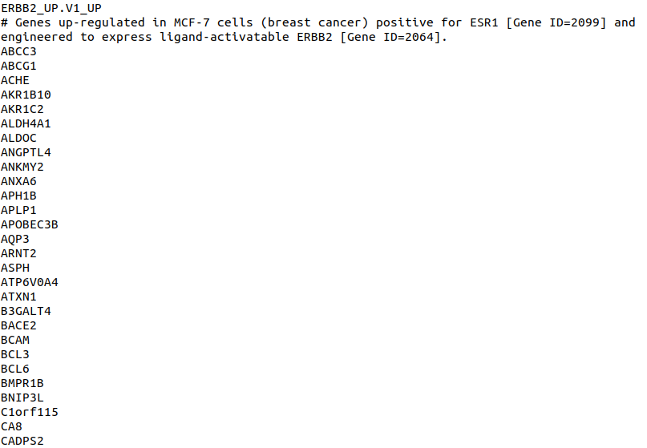
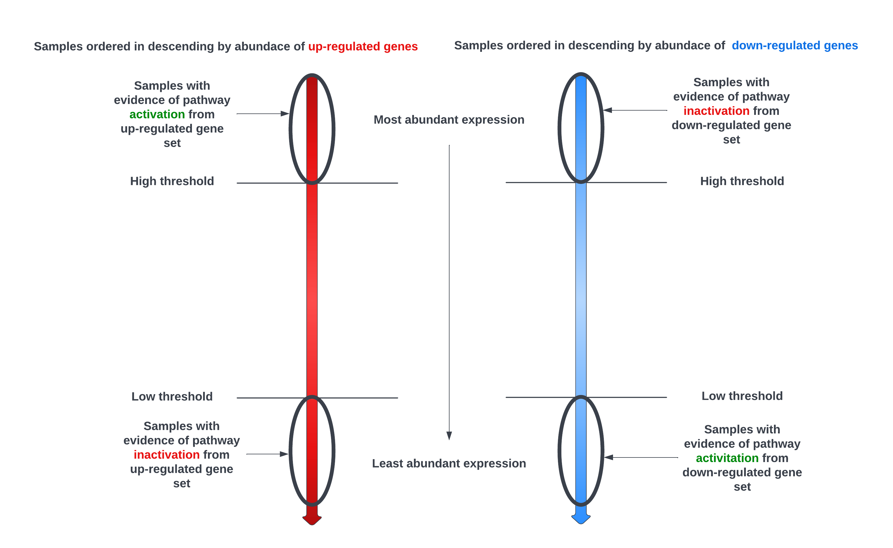

```{r setup, include = FALSE}
knitr::opts_chunk$set(
  collapse = TRUE,
  comment = "#>",
  message = FALSE,
  warning = FALSE
)
```

# Introduction
PathAnalyser is an intuitive and user-friendly package that allows users to 
assess pathway activity of transcriptomic data sets using the gene 
signature of a pathway. A gene signature comprises of a list of up-regulated 
genes and down-regulated genes when a specific pathway is active. Unique to 
PathAnalyser is the ability to classify samples according to the consensus of 
evidence of expression of *both parts of the gene signature* 
(up-regulated and down-regulated gene sets) for each sample, in contrast to 
other gene set enrichment analysis packages that fail to distinguish between 
these two gene sets, thus considering the signature as a single gene set. A 
key strength of the package is there is no direct forcing of samples into 
pathway "active" or "inactive" classes, rather samples that lack consensus 
between the two parts of the signature are classified as having "uncertain" 
pathway activity.

PathAnalyser provides functionality and built-in data (including expression data
set as well as gene signatures) for assessing ER and HER2 pathway activity in 
breast cancer transcriptomic data sets. These transcriptional signatures have 
been shown to have clinical predictive value, in particular, ER and HER2 gene 
signatures have been associated with molecular sub-types, prognosis and 
treatment response in breast cancer. Although this package was original 
developed to assess ER and HER2 pathway activity in breast cancer transcriptomic 
data sets, the package functionality is flexible and could be applied to 
transcriptomic data sets and gene signatures outside the context of breast 
cancer. 

In this vignette, we will describe how to use the PathAnalyser package 
with microarray and RNA-seq expression transcriptomic data sets and gene 
expression signatures associated with a specific pathway activity.

# General Workflow
The typical workflow of pathway activity assessment using PathAnalyser is 
illustrated in Figure \@ref(fig:workflow). Gene expression data and signature 
files are read into matrix and data frame formats respectively to allow 
classification of samples using PathAnalyser.

```{r workflow, echo=F, fig.wide=TRUE, fig.cap="PathAnalyser workflow"}
knitr::include_graphics("workflow_flowchart.png")
```

Note: The **classification evaluation step is optional** and can only be 
performed if actual pathway activity class labels (e.g. active, inactive or 
uncertain) for the corresponding pathway are present.

# Installation and setup
## Installing dependencies
All dependencies should be installed together with the PathAnalyser package,
however, they can be installed separately. To install all required CRAN 
dependencies of PathAnalyser, type the following in R:
```{r eval=F}
install.packages(c("ggfortify", "ggplot2", "glue", "lifecycle", "cli", "plotly",
                   "reader", "pROC", "reshape2", "rlang", "VennDiagram", "withr"
                   ))

```
All Bioconductor dependencies can be installed by typing the following in R:
```{r eval=F}
BiocManager::install(c("edgeR", "limma"))
```


## Installing package 
It is **strongly recommended** that users install the latest source release for 
PathAnalyser by downloading the source file on GitHub from this [link](https://github.com/ozlemkaradeniz/PathAnalyser/releases/tag/v0.0.0.9000) 
and then installing this local source version of the package in R:
```{r eval=F}
install.packages("PathAnalyser_0.0.0.9000.tar.gz", repos=NULL, type="so")
```

### Using devtools for direct installation from GitHub
PathAnalyser can also be installed directly from GitHub using the devtools 
package in R, provided the PathAnalyser GitHub repository is public:
```{r eval=F}
install.packages("devtools")
devtools::install_github("ozlemkaradeniz/PathAnalyser")
```
**Note: If the PathAnalyser repository is not public, the `install_github` 
function will not download and install the package.**

### Cloning the repository (for developers)
Alternatively, for users who would like to extend the PathAnalyser package, they 
can clone the GitHub repository in a Linux / MacOS terminal:
```{bash eval=F}
git clone git@github.com:a-thind/PathAnalyser.git
```
and build the package from the source files using devtools:
```{r eval=F}
devtools::build("~/PathAnalyser")
```
**Note: Building the package from source files requires r-base-dev 
(Linux/MacOS) or Rtools (Windows) installation on top of the base R installation
.**

Once installation is completed, load the library to start using PathAnalyser:
```{r message=FALSE, warning=FALSE, cache=FALSE}
library(PathAnalyser)
```

# Data formats
The classification algorithm of PathAnalyser requires two types of input data:

1. **Gene expression matrix** - a gene-by-sample gene expression matrix, with 
row names corresponding to gene names and column names corresponding to sample 
names / IDs.
2. **gene signature data frame** - a data frame of expression values corresponding 
to a list of genes associated with a pathway. The first column contains gene 
names and the second column contains expression values: -1 for down-regulated or
1 for up-regulated genes when a specific pathway is active.

## Input files
The two data types described above (gene expression matrix and gene signature 
dataframe) can be created from two types of input files:

1. *Gene expression matrix file* - a tab-delimited text file containing a gene 
expression matrix, where rows represent genes and columns samples of a gene 
expression data set. The gene expression matrix text file can contain expression 
values from RNASeq or normalized microarray data. The image below is a snapshot 
of an example expression data set file:

```{r echo=FALSE, fig.cap="An example gene expression matrix text file"}
knitr::include_graphics("expr_dataset_example.png")
```

The first line contains the sample names and the first column contains gene 
names. All other tab-separated fields represent expression values for each gene
for each sample from either RNASeq or microarray experiments. 

**Note: PathAnalyser does not provide functionality for unnormalized microarray 
data, so the user must ensure the microarray data is normalized prior to 
performing classification by PathAnalyser.**  

2. *Gene signature files* - this data is provided as two text files containing 
a list of genes provided in the [gene set file format](https://software.broadinstitute.org/cancer/software/gsea/wiki/index.php/Data_formats#GRP:_Gene_set_file_format_.28.2A.grp.29) (using .grp file extension) - one for the up-regulated gene set 
and another containing the down-regulated gene set of the pathway signature. 
A plethora of pathway gene signatures in the gene set file format can be found at 
[MSigDB](https://www.gsea-msigdb.org/gsea/msigdb/index.jsp). The snapshot below
shows the first 30 lines of the gene set file for the up-regulated gene set of 
the ERBB2 (HER2) gene signature.  

```{r echo=FALSE, fig.cap="An example gene set file format containing either the up- or down-regulated gene sets of the gene signature"}

```

**Note: `read_signature` from PathAnalyser only accepts gene signatures 
that have the up-regulated and down-regulated gene sets in separate gene set 
format text files (with file extension .grp). The user is expected to provide one 
up-regulated and one down-regulated gene set file for a pathway gene signature.**

# Built-in datasets and gene signatures
## Gene expression signatures
PathAnalyser contains two gene signatures for active ER and HER2 pathways that 
can be used to assess ER and HER2 pathway activity in a breast cancer 
transcriptomic data set. These signatures are accessible by typing the following 
in R:

```{r}
data("ER_sig_df")
data("HER2_sig_df")
```
### ER signature
The built-in ER signature `ER_sig_df` is a data frame containing the names of 
160 differentially expressed genes which constitute the transcriptional 
signature of ER pathway activation. This signature was obtained from the 
sensitivity to endocrine therapy genome index defined by Symanns et al. (2011). 
The total number of genes that are up-regulated (denoted with an expression 
value of 1) and down-regulated (denoted with an expression value of -1) in this 
gene signature are 101 and 59 genes respectively.
```{r}
dim(ER_sig_df)
head(ER_sig_df)
# up-regulated genes are given an expression value of 1
ER_up_sig <- ER_sig_df[ER_sig_df$expression == 1 ,]
dim(ER_up_sig)
# down-regulated genes are given an expression value of -1
ER_dn_sig <- ER_sig_df[ER_sig_df$expression == -1 ,]
dim(ER_dn_sig)
# for more details
?ER_sig_df
```

### HER2 signature
A gene expression signature for HER2 (ERBB2) pathway activation `HER2_sig_df` is 
also provided by PathAnalyser. This gene signature was obtained from Molecular 
Signatures Database ([MSigDB](https://www.gsea-msigdb.org/gsea/msigdb/index.jsp)) 
by combining the up-regulated (gene set:
[SMID_BREAST_CANCER_ERBB2_UP](https://www.gsea-msigdb.org/gsea/msigdb/cards/SMID_BREAST_CANCER_ERBB2_UP.html)
) and down-regulated (gene set:
[SMID_BREAST_CANCER_ERBB2_DN](https://www.gsea-msigdb.org/gsea/msigdb/cards/SMID_BREAST_CANCER_ERBB2_DN.html)
) gene sets available at MSigDB, originating from transcriptomic profiling of a 
344 primary breast tumor samples in a study by [Smid et al. 2010][References] in 
a study examining the subtypes of breast cancer and organ-specifc relapse. 

The names of 156 differentially expressed genes are in the HER2 signature data 
frame provided by PathAnalyser, of which 190 are up-regulated 
(denoted by an expression of 1) and 197 are down-regulated (denoted by an 
expression of -1).
```{r}
dim(HER2_sig_df)
head(HER2_sig_df)
# up-regulated genes are given an expression value of 1
HER2_up_sig <- HER2_sig_df[HER2_sig_df$expression == 1 ,]
dim(HER2_up_sig)
# Down-regulated genes are given an expression value of -1
HER2_dn_sig <- HER2_sig_df[HER2_sig_df$expression == -1 ,]
dim(HER2_dn_sig)
# for more details
?HER2_sig_df
```
## Gene expression datasets
PathAnalyser also contains two built-in gene expression matrices each containing
RNA-seq raw read counts for primary breast cancer samples obtained from 60 
individuals (cases). Data for these matrices were obtained from The Cancer 
Genome Atlas ([TCGA](https://www.cancer.gov/about-nci/organization/ccg/research/structural-genomics/tcga)).
Each expression matrix contains 20,124 genes.
```{r}
data("ER_TCGA_RNAseq")
data("HER2_TCGA_RNAseq")
# column names represent case (sample) IDs from TCGA
```

### ER dataset 1
The ER data set `ER_TCGA_RNAseq` contains RNASeq raw read counts for 60 primary 
breast cancer samples, 30 of which have ER pathway activity (ER+) and 30 which 
have inactive ER pathway activity (ER-).
```{r}
dim(ER_TCGA_RNAseq)
# Expression data for first 6 genes
head(ER_TCGA_RNAseq[,1:5])
```

### HER2 dataset 1
Similarly, the HER2 data set `HER2_TCGA_RNAseq` contains RNASeq raw read counts for 
60 primary breast cancer samples, 30 of which have HER2 (ERBB2) pathway activity 
(HER2+) and 30 which have inactive HER2 pathway activity (HER2-).

```{r}
dim(HER2_TCGA_RNAseq)
# Expression data for first 6 genes of the first 5 samples
head(HER2_TCGA_RNAseq[,1:5])
```


# Reading input data using PathAnalyser
There are two types of input required for pathway activity assessment using 
PathAnalyser:

1.  gene expression data matrices
2.  gene expression signatures

## Gene expression data
The `read_expression_data` function reads gene expression data from  
a file with an delimiter, the function checks the delimiter of the
file and reads the file accordingly. It returns an output with gene symbols/IDs as the row names and columns representing each sample 
IDs in the dataset.
```{r eval=FALSE}
data_se <- read_expression_data("~/data/TCGA_unannotated.txt")
data_se<-data_se[,1:200]
print(data_se[1:5, 1:5])


```

## Gene signature data
Gene signature files can be read by the `read_signature` function. It returns a dataframe with signature IDs/symbols in the
first column and their expression pattern is represented as up r
regulated or down regulated by +1 and -1 respectively.
```{r eval=FALSE}
sig_df <- read_signature("~/data/ESR1_UP.v1._UP.csv", "~data/ESR1_DN.v1_DN.csv")
head(sig_df)
```


## Quality control and pre-processing of data
### Log Counts Per Million (CPM) transformation of RNASeq expression matrices
The log_cpm_transform function transforms the raw data by the method of log 
CPM and returns the transformed data. It also performs sanity check of the 
transformation by returning box plots for visualization of distribution of data 
before and after transformation.
```{r fig.wide=TRUE}
# using toy data set as expression matrix
data("ER_TCGA_RNAseq")
data_se <- ER_TCGA_RNAseq 
normalized_se <- log_cpm_transform(data_se)
```

### Checking and filtering genes from the gene expression matrix
The gene names are first checked for inclusion in the gene signature data frame.
Genes that are included in the gene signature are retained then subjected to 
further filtration, in which their expression across the data set measured. If 
a gene is not present in at least 10% of the total number of samples in the 
data set, the gene is dropped from the expression matrix. A console message is
printed reporting the number of features (genes) retained in the final 
normalized expression matrix.
```{r fig.wide=TRUE}
normalized_se <- check_signature_vs_dataset(normalized_se, ER_sig_df)
```


# Classifying samples by pathway activity using gene signatures
## Overview of pathway activity classification
PathAnalyser provides assessment of pathway activity for each sample in a gene 
expression data set, by extending an existing unsupervised and non-parametric 
sample-wise gene set enrichment method called Gene set variation analysis ([GSVA](https://www.bioconductor.org/packages/release/bioc/html/GSVA.html)). 
GSVA measures the variation of gene set enrichment across a sample population in 
a manner independent of class labels, and summarizes the sample-wise expression 
of the gene set in the form of gene set enrichment scores for each sample 
([Hänzelmann et al. 2013][References]). However, unlike GSVA, which does not 
distinguish up-regulated gene sets from down-regulated gene sets, PathAnalyser 
considers the expression of the up-regulated and down-regulated gene 
sets of a given pathway's gene signature both separately and explicitly, using 
the GSVA method solely for estimating the relative abundance of expression of 
the up- and down-regulated gene sets for a given pathway in each sample.

## Overall PathAnalyser classification algorithm
The estimated expression abundance for both these gene sets is used 
to check expression consistency with the gene signature and infer pathway
activity for a given sample in the transcriptomic data set.

The classification algorithm implemented in PathAnalyser uses four thresholds 
for the classification algorithm (two for each gene set of the pathway 
signature):

1. **High** expression abundance for **up-regulated gene set**
2. **Low** expression abundance for **up-regulated gene set**
3. **High** expression abundance for **down-regulated gene set**
4. **Low** expression abundance for **down-regulated gene set**

Figure \@ref(fig:algorithm) below summarises the classification algorithm 
employed by PathAnalyser to classify samples by pathway activity.

```{r algorithm, echo=FALSE, fig.wide=TRUE, fig.cap="Overiew of algorithm diagram"}

```

Samples are ordered ordered by the expression abundance of the up-regulated 
gene-set and then ordered by the expression abundance of the down-regulated 
gene-set, as summarised by the GSVA scores. Those samples which have a GSVA 
score exceeding the "high


Samples are ordered by expression abundance of up-regulated and down-regulated 
genes of the gene signature separately using the GSVA scores. Those samples 
which have the most abundant expression of the up-regulated gene set 
(exceeding threshold 1) show evidence of activation of the pathway but are only 
classified as having the pathway "*Active*", if the same samples show a low 
abundance of expression of the down-regulated genes (below threshold 4) of the 
gene signature i.e. demonstrating consistency between evidence from up- and 
down-regulated gene sets of the gene signature. Similarly, samples with evidence 
of pathway inactivation from the up-regulated gene set of the gene signature 
i.e. the least abundant expression of the up-regulated genes of the gene 
signature (below threshold 2) and which also show evidence of pathway 
inactivation from the down-regulated gene set of the signature i.e. 
most abundance expression of the down-regulated gene set of the gene signature
(exceeding threshold 3), demonstrate evidence of consistency of pathway 
inactivation from both gene sets and therefore are classified as "*Inactive*".
All other samples are classified as "*Uncertain*" since there is insufficient 
evidence (lack of consensus from both parts of the signature) for pathway 
activation or inactivation.

In PathAnalyser, the GSVA scores thresholds for classifying a sample as "Active" 
(consistent with the gene signature) and "Inactive" (inconsistent with the gene 
signature) can be set manually and depend on the user's pathway activity 
classification requirements. 

PathAnalyser provides two functions for classifying samples using an absolute 
GSVA scores thresholds `classify_GSVA_abs` or percentile thresholds which is 
effectively rank-based `classify_GSVA_percent` using percentiles (default at 25%)
, as well as a visualization function to view the distributions of the GSVA 
scores for both gene sets `gsva_scores_dist`, which will be discussed below.

## Classification using percentile GSVA score thresholds
The package also provides a GSVA-based classification method 
`classify_GSVA_percent`, which uses percentile ranks as thresholds rather than 
absolute GSVA thresholds. The default percentile used by the function is 25%, so
the high expression abundance thresholds in both gene sets would be 75%, by 
default and low expression abundance thresholds in both gene sets would be 25%, 
default. A custom percentile threshold can be provided using the optional 
`thresh_percent` parameter. As for the absolute threshold function, a summary of 
the classification is printed to the console highlighting the number of samples 
in each pathway activity class ("Active", "Inactive" and "Uncertain") and the 
number of samples in total. Increasing the percentile threshold for 
classification has the equivalent effect of reducing the distance between the 
high expression abundance and low expression abundance thresholds for both gene 
sets, therefore reducing the frequency of "Uncertain" classifications.
```{r}
# default percentile = 25% (quartile)
classes_df <- classify_GSVA_percent(ER_sig_df, normalized_se)
# custom percentile = 30%
classes_df <- classify_GSVA_percent(ER_sig_df, normalized_se, 
                                            percent_thresh=30)
```

# Visualising pathway activity
An interactive PCA plot providing a visual summary of the pathway-based 
classification can be produced by using the `classes_pca` function with the 
normalized data set and predicted classes data frame. Each point represent a 
sample in the expression data set and are colored according to the predicted 
activity class ("Active", "Inactive", "Uncertain"). Hovering over the sample 
points displays the sample name, along with predicted pathway activity class and
also the relative coordinates of the sample in the first two principal 
components.

## Generating PCA plot
```{r}
classes_pca(normalized_se, classes_df, pathway = "ER")
```
# Evaluating pathway activity classification
This package provides a method `calculate_accuracy` for evaluating pathway 
activity classification, which gets the actual labels and the labels classified
by the classification methods as parameters; then creates confusion matrix based
on them. The first parameter `true_labels_source` could be file-name, matrix or 
data frame and contains sample names and their corresponding actual 
labels.The second parameter `classes_df` could be matrix or data frame and 
contains classified labels found by the classification methods 
`classify_GSVA_percent` or `classify_GSVA_abs`. Third parameter `pathway` 
specifies with which pathway the labels(actual and classified) are  associated. 
Other parameters `show_stats` and  `roc_curve` are boolean flags
used as optional features to display statistics and ROC Curve respectively.
Default values for the flags is FALSE.


```{r fig.wide=TRUE}
true_labels_df <- read.table("../inst/extdata/Sample_labels.txt", sep="\t", 
                             header=T)
confusion_matrix <- calculate_accuracy(true_labels_df, classes_df, 
                                       pathway = "ER", show_stats=TRUE, 
                                       roc_curve=TRUE)
```

# Example: Assessing ER pathway activity in a breast cancer RNAseq dataset
To demonstrate the standard workflow of assessing pathway activity in a 
transcriptomic data set using PathAnalyser, we will use PathAnalyser to 
classify samples in an RNA seq data set according to ER pathway activity as
("Active", "Inactive" or "Uncertain") for the ER pathway. The ER pathway status 
of tumors is of particular interest since, activation of the pathway is 
correlated sensitivity to endocrine therapy and disease prognosis more broadly.
The data set collected from The Genome Atlas Project (TCGA) contains raw read 
counts for over 20,000 genes (almost the complete human transcriptome) for 20 
primary breast cancer samples. Ten samples were shown have the ER pathway active 
(ER+), while the remaining ten samples were reported to be inactive for the ER 
pathway (ER-).

## Read RNASeq gene expression dataset and ER pathway signature data
First, the gene expression matrix data set text file which contains raw read 
counts for the 20 breast cancer samples and ER gene signature text files 
(up-regulated and down-regulated gene set files) are read into the expression 
matrix and gene signature data frame data types respectively. The gene 
expression matrix contains raw read counts for 20,124 genes and 20 samples. 
Additionally, the ER signature compiled from the Sensitivity to Endocrine Therapy
(SET) index proposed by [Symanns et al. (2011)][References] contains 160 genes of 
which 59 are down-regulated and 101 are up-regulated.
```{r}
# Load transcriptomic data set (gene expression matrix of samples)
data_se <- read_expression_data("toy_data.txt")
dim(data_se)
head(data_se)
# read signature data from the two individual gene set files for up-regulated
# and down-regulated gene sets
ER_sig <- read_signature("ESR1_UP.v1._UP.grp", "ESR1_DN.v1_DN.grp")
dim(ER_sig)
```

## QC and pre-processing of the expression dataset and ER signature data
As the gene expression matrix file contained raw RNASeq counts, the data must be 
normalized prior to passing the matrix to any of the classification functions. 
Normalization of read counts is necessary to account for differences in 
sequencing depths among the libraries. The PathAnalyser `log_cpm_transform` 
function can be used to perform a log counts per million (CPM) transformation on 
the gene expression matrix. Furthermore, `log_cpm` graphically confirms the 
logCPM transformation has been performed correctly since the box plots 
displayed by the function, representing the logCPM values for each sample, are 
more aligned following the logCPM transformation compared to before the
transformation. 
```{r fig.wide=T}
# Transforming matrix with log cpm transformation and sanity check of the transformation
normalized_se <- log_cpm_transform(data_se)
```
To ensure that the gene names in the gene signatures and gene 
expression data set are consistent, we use the `check_signature_vs_dataset` gene 
names to filter out genes from the gene expression matrix that are not in 
signature and those genes which are not expressed in at least 10% of samples. 
The output of running the function on the normalised dataset and ER signature 
shows that 147 genes were retained in the normalised dataset with 13 genes being
dropped either due to expression in less than 10% of samples, or due to being 
absent in the ER signature.
```{r fig.wide=TRUE}
normalized_se <- check_signature_vs_dataset(normalized_se, ER_sig)
dim(normalized_se)
```


## Classifying breast cancer samples based on ER pathway activity.
Once the expression matrix is normalised to logCPM and genes with insufficient 
counts or those that do not feature in the ER signature are removed, the 
expression data set is ready for classification alongside the ER signature. To
acquire an idea of the distribution of GSVA scores, the gene expression matrix
can be passed as an argument along with the ER signature to the 
`gsva_scores_dist`. A bimodal density plot is often produced for the 
up-regulated and down-regulated gene set of the ER signature, reflective of 
the often binaric nature of gene expression in samples of a dataset discussed 
above. The peak centered around the GSVA score of -0.8 for the down-regulated 
gene set and the peak around 0.8 for the down-regulated gene set represent the 
mode of samples with the low expression abundance of the down-regulated genes of 
the ER signature and high abundance of the up-regulated genes of the ER 
signature respectively. Similarly, for the up-regulated genes of the ER pathway 
signature, the peak situated at around a GSVA score of -0.7 and and around the 
GSVA score of 0.9 represent samples of low expression abundance and high 
expression abundance of the up-regulated genes of the ER pathway signature 
respectively.

```{r fig.wide=TRUE}
gsva_scores_dist(ER_sig, normalized_se)

```
Samples in a gene expression matrix can be classified according to evidence of 
expression consistency with the up-regulated and down-regulated gene sets of the
ER signature using GSVA by using absolute thresholds for high and low expression 
for each gene set of the ER signature via `classify_GSVA_abs` or percentile 
threshold for high and low expression for each gene set of the ER signature via 
`classify_GSVA_percent`. Here, we use the default percentile thresholds of 25%
to classify samples as having high or low expression abundance with the 
up-regulated and down-regulated gene sets of the ER gene signature. The R 
console output of running the `classify_GSVA_percent` on our data set and 
ER signature, shows that of the 20 samples in our data set, 4 samples were 
classified as active and 5 samples were classified as inactive for the ER 
pathway. Eleven samples were classified as uncertain. A data frame is produced 
with names of the 20 samples as the first column and their corresponding 
predicted ER pathway activity classes as the second column.

```{r}
classes_df <- classify_GSVA_percent(ER_sig, normalized_se)
head(classes_df)
```
Depending on the user's classification requirements the thresholds can be 
adjusted. For example, if the user would like to reduce the number of 
"Uncertain" classification samples, the user could provide 50% percentile 
threshold as an argument e.g.:
```{r}
classes_df_50p <- classify_GSVA_percent(ER_sig, normalized_se, 
                                        percent_thresh=50)
```
From the output of running the classification function with 50% percentile, it 
is evident that no samples were classified as "Uncertain", with 10 samples 
classified as "Active" and 10 samples classified as "Inactive" by the 
classification algorithm.

Alternatively, the breast cancer samples in the data set could be classified 
by ER pathway activity, using absolute GSVA score thresholds for the 
up-regulated and down-regulated gene sets of the ER signature respectively.

```{r}
classes_df_abs <- classify_GSVA_abs(ER_sig, normalized_se, up_thresh.low = -0.2, 
                                    up_thresh.high = 0.2, dn_thresh.low = -0.2, 
                                    dn_thresh.high = 0.2)
```

## Visualizing ER pathway activity classification of the breast cancer samples
To acquire a visual summary of the ER pathway-based classification of our 20 
breast cancer samples, we can run the `classes_pca` function to produce an 
interactive PCA plot of the samples colored by the predicted ER pathway 
activity status (active, inactive, uncertain).
```{r}
classes_pca(normalized_se, classes_df, pathway = "ER")
```
The PCA plot shows the samples predicted as active and inactive form 
relatively tight clusters in the first principal component (PC), as would be expected 
since the inter-variation within the active and inactive classes would be 
smaller than between the different classes. Interestingly, the active and 
inactive clusters are in opposite quadrants in the first PC indicating the 
samples have been separated according to pathway activity well in the first PC. 
Furthermore, samples classified as uncertain are more scattered in the first PC, 
with a few samples present in the active / inactive clusters. Overall the PCA plot
shows the samples have clustered well according to the predicted pathway 
activity classes. Sample names and their corresponding predicted pathway 
activity class can be displayed for a given sample on the plot by hovering over 
a sample point using a mouse pointer.

## Assessing the accuracy of the pathway-based classification
A more detailed assessment of the ER pathway based classification of the breast
cancer samples can be performed by providing the true pathway activity class 
labels for each sample, along with predicted pathway activity classes 
`classes_df` to the `calculate_accuracy` function. These "true labels" must only 
contain ("Active", "Inactive or "Uncertain") for the `calculate_accuracy` 
function to correctly assess the pathway-based classification. The pathway 
parameter is set to "ER" since ER pathway activity is being assessed. The 
function outputs a confusion matrix reporting in tabular form, the number of 
true positives (TP), true negative(TN), false positives (FP), false negatives 
(FN) and also a breakdown of the number of uncertain classifications and their 
actual pathway activity status. Further classification evaluation using the 
`show_stats` reveals an accuracy of 100% of among the 9 classified 
samples, the 4 samples classified as ER positive were actually ER positive and 
similarly, the 5 samples classified as ER negative were indeed ER negative.
```{r fig.wide=TRUE}
# read true pathway activity class labels for data set samples
true_labels_df <- read.table("../inst/extdata/Sample_labels.txt", 
                             header=TRUE, sep = "\t")
# assess accuracy and generate confusion matrix for classification
confusion_matrix <- calculate_accuracy(true_labels_df, classes_df, 
                                       pathway = "ER")
# detail breakdown of classification evaluation (accuracy, % classified etc)
confusion_matrix <- calculate_accuracy(true_labels_df, classes_df, 
                                       pathway = "ER", show_stats = T)
```
In addition to a detail summary of the classification assessment, we can also 
view a receiver operating curve (ROC) curve for our classification, which 
visualizes the sensitivity and specificity of the data set classification by 
fitting a logistic regression model to the binary ER pathway activity 
classifications (active, inactive):

```{r fig.wide=TRUE}
# detail breakdown of classification evaluation (accuracy, % classified etc)
confusion_matrix <- calculate_accuracy(true_labels_df, classes_df, 
                                       pathway = "ER", show_stats = T,
                                       roc_curve = T)
```
In concordance with the statistical classification evaluation metrics, the ROC 
curve also shows that the samples were classified well according to ER pathway 
activity by the curve reaching the top left corner of the plot (indicating a 
high true positive rate and a low false positive rate). The nine points 
represent the nine samples classified as "active" / "inactive" for the ER 
pathway.

# Session Info
The output of `sessionInfo` upon which this file was generated:
```{r cache=FALSE}
sessionInfo()
```

# References
Hänzelmann, S., Castelo, R. & Guinney, J. GSVA: gene set variation analysis for 
microarray and RNA-Seq data. BMC Bioinformatics 14, 7 (2013). 
https://doi.org/10.1186/1471-2105-14-7

Smid, M., Wang, Y., Zhang, Y., Sieuwerts, A.M., Yu, J., Klijn, J.G., 
Foekens, J.A. and Martens, J.W., 2008. Subtypes of breast cancer show 
preferential site of relapse. Cancer research, 68(9), pp.3108-3114.

Symmans, W.F., Hatzis, C., Sotiriou, C., Andre, F., Peintinger, F., Regitnig, 
P., Daxenbichler, G., Desmedt, C., Domont, J., Marth, C. and Delaloge, S., 
2010. Genomic index of sensitivity to endocrine therapy for breast cancer. 
Journal of clinical oncology, 28(27), p.4111. 
https://dx.doi.org/10.1200%2FJCO.2010.28.4273

# Appendix
## Visualising GSVA Score Distribution
PathAnalyser provides `gsva_scores_dist` method to visualize the GSVA score 
distribution for the abundance of expression of the up-regulated and 
down-regulated gene sets of the gene signature for each sample. The resulting 
density plot usually follows a bimodal distribution of GSVA scores for each 
sample for the up-regulated and down-regulated gene sets, a consequence of the 
intrinsic binaric nature of gene expression in datasets, where samples are often
either have a relatively high expression abundance of a gene set, or relatively
low expression abundance of a gene set resulting in two "sub-populations" of 
samples.

Figure \@ref(fig:plot) shows two peaks for each gene set when running 
`gsva_scores_dist` with logCPM-normalized `ER_TCGA_RNAseq` gene expression matrix. For 
both gene sets, the peak with the highest GSVA scores represents samples with 
*high* abundance of expression of the gene set and the lower score peak 
represents samples with *low* abundance of expression of the gene set.
```{r plot, fig.cap="Density plots showing the distribution of GSVA scores for samples in logCPM-normalised `ER_TCGA_RNAseq` data set for the up-regulated (left) and down-regulated gene set (right) of the pathway signature using `gsva_scores_dist` function.", fig.wide=TRUE}
gsva_scores_dist(ER_sig_df, normalized_se)
```

### Determining thresolds for classification
As the two peaks represent represent low expression abundance and high 
abundance expression, the distribution of GSVA scores that constitute the "valley"
i.e. the area between the two peaks (fig. \@ref(fig:thresholds)), represent 
samples that exhibit relatively weaker evidence of differential expression 
abundance relative to other samples and the algorithm would classify these 
samples as having "Uncertain" pathway activity. Because the peaks represent the 
mode GSVA scores (one for high and low expression abundance), thresholds should 
be selected between these two peak to enable the algorithm to classify samples 
around these modes as being consistent or inconsistent with the pathway 
signature.

As mentioned above, there are four thresholds that can be tuned by the user:
the high and low expression abundance for the up-regulated and down-regulated
gene sets. For example, a user could set the high expression abundance thresholds 
for the up-regulated gene set to -0.2 for the low expression threshold for both gene 
sets, and 0.2 for the high expression thresholds for both gene sets. Samples 
with GSVA scores between the these thresholds for both the up-regulated and down
-regulated gene-set would be considered by the classification algorithm as having 
"Uncertain" pathway activity.

```{r thresholds, fig.cap="GSVA scores distributions of the samples for the down-regulated (left) and up-regulated gene set (right) of the pathway gene signature, showing absolute thresholds of -0.2 and 0.2 for characterising low and high expression abundance of both gene sets respectively. The expression data set used is the logCPM-normalised `ER_TCGA_RNAseq` gene expression data set.", fig.wide=TRUE}
plot <- gsva_scores_dist(ER_sig_df, normalized_se)
# Add thresholds on plot
library(ggplot2)
data_threshs <- data.frame(Geneset=c("Up", "Down"), vline=c(-0.2, 0.2))
plot + geom_vline(xintercept=data_threshs$vline, linetype=2)
```

Shrinking the distance between the high and low expression thresholds would 
result in fewer "Uncertain" pathway activity classifications 
(fig. \@ref(fig:relaxed)), because more samples would meet the consistency/ 
inconsistency expression thresholds for the pathway signature (high expression 
thresholds would be lower, low expression thresholds would be higher for each 
gene set).

```{r relaxed, fig.cap="GSVA scores distributions of samples with more relaxed thresholds for assessing expression consistency of the down-regulated gene set (left) and the up-regulated gene set (right) with the pathway gene expression signature. Low and high expression abundance thresholds for the down-regulated gene set (left) are set to -0.1 and 0.1 respectively, while low and high expression abundance thresholds for the up-regulated gene set (right) are also set to -0.1 and 0.1 respectively. Data is generated from running GSVA on logCPM-normalised `ER_TCGA_RNAseq` expression dataset with ER signature (`ER_sig_df`).", fig.wide=TRUE}
# more relaxed thresholds, fewer uncertain labels
data_threshs <- data.frame(Geneset=c("Up", "Down"), 
                           vline=c(-0.1, 0.1))
plot + geom_vline(xintercept=data_threshs$vline, linetype=2)
```

Conversely, expanding the distance between the thresholds would increase the 
frequency of "Uncertain" pathway activity classifications, as the number of samples
meeting the thresholds for consistency and inconsistency would be reduced.

```{r stringent, fig.cap="Density plots for GSVA scores distributions for samples with relatively more stringent thresholds for assessing consistency of the up-regulated gene set (left) and down-rgulated gene set (right) with the pathway signature. The low and high expression abundance thresholds are -0.4 and 0.4 for both up-regulated and down-regulated gene sets respectively. Data is generated from running GSVA on logCPM-normalised `ER_TCGA_RNAseq` expression dataset with ER signature (`ER_sig_df`).", fig.wide=TRUE}
# more stringent thresholds, greater uncertain labels
data_threshs <- data.frame(Geneset=c("Up", "Down"), vline=c(-0.4, 0.4))
plot + geom_vline(xintercept=data_threshs$vline, linetype=2)
```

## Classification using absolute GSVA score thresholds
As the distribution of GSVA scores tends to be biomodal rather than Guassian, 
the user may prefer to use absolute GSVA thresholds for checking consistency of 
expression abundance of each gene set with pathway signature for each sample.
PathAnalyser provides the `classify_GSVA_abs` function for classifying samples 
by pathway activity using absolute GSVA score thresholds which can be tuned by
the user:

- `up_thresh.high`: for high expression abundance for the 
up-regulated gene-set
- `up_thresh.low`: for low expression abundance for the 
up-regulated gene-set of the gene signature
- `dn_thresh.high`: for high expression abundance for the 
down-regulated gene-set of the gene signature 
- `dn_thresh.low`: for low expression abundance for the 
down-regulated gene-set of the gene signature

Note that absolute thresholds are required from the user when running 
`classify_GSVA_abs` and can be positive or negative numbers. A summary of the 
classification is printed to the console highlighting the number of samples in 
each pathway activity class ("Active", "Inactive" and "Uncertain") and the 
number of samples in total.
```{r}
classes_df <- classify_GSVA_abs(ER_sig_df, normalized_se, 
                                    up_thresh.low=-0.2, up_thresh.high=0.2, 
                                    dn_thresh.low=-0.2, dn_thresh.high=0.2)
```
